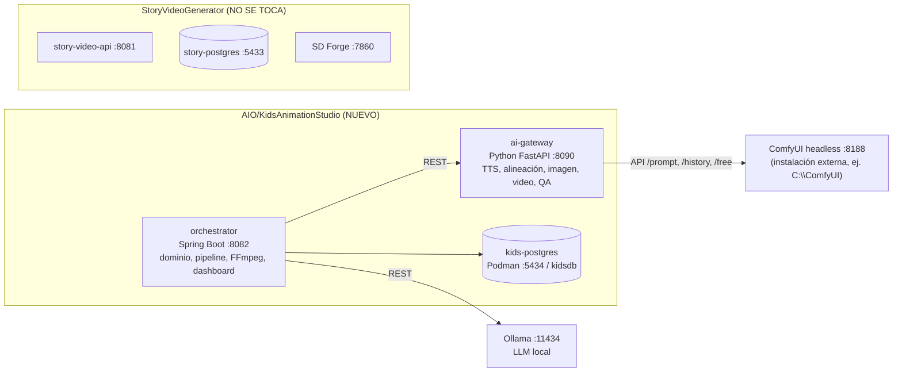
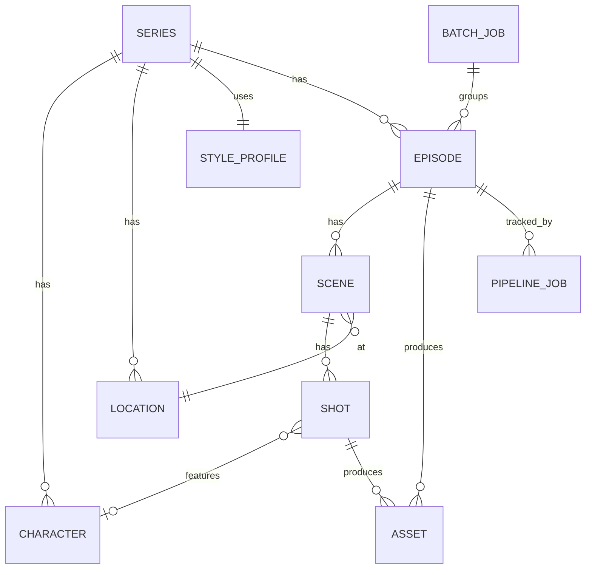
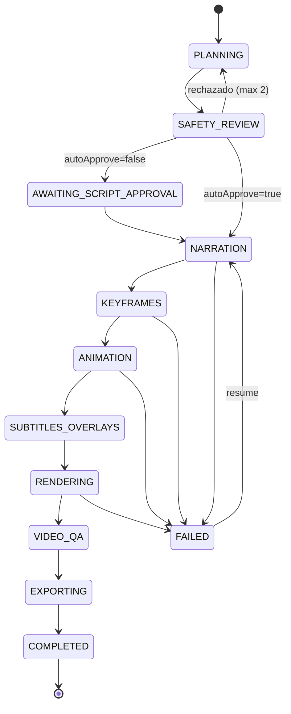

# Plan de implementación: KidsAnimationStudio

Pipeline local y automatizado de videos animados educativos para niños menores de 7 años, **como proyecto hermano e independiente** de `StoryVideoGenerator`.

> [!CAUTION]
> **Regla #1 para quien implemente: NO se modifica nada dentro de `AIO/StoryVideoGenerator/`.** Ni código, ni `pom.xml`, ni `.env`, ni migraciones, ni scripts, ni carpetas `audio/`, `storage/` o `export_videos/`. Se puede **leer y copiar** código de ahí (copiar, renombrar el paquete y adaptar), pero nunca referenciarlo como dependencia ni editarlo. Para comprobarlo al final de cada fase: `git status -- StoryVideoGenerator` y `git diff --stat -- StoryVideoGenerator` no deben mostrar nada.

---

## 1. Decisión de arquitectura

### 1.1 ¿Por qué un proyecto nuevo y no un módulo dentro del actual?

| Opción | Veredicto |
| :--- | :--- |
| Agregar servicios dentro de `StoryVideoGenerator` | ❌ Contradice el requisito, mezcla dominios (terror/misterio vs. infantil) y arriesga el proyecto que ya funciona. |
| Módulo Maven compartido (`common`) entre ambos | ❌ Obliga a reestructurar el `pom.xml` existente. |
| **Proyecto hermano `AIO/KidsAnimationStudio/`** con código copiado y adaptado | ✅ **Recomendada.** Cero acoplamiento, mismo stack que el usuario ya domina (Spring Boot 3.3 / Java 21 / Postgres / FFmpeg) y la misma forma de operarlo. |

### 1.2 Componentes



| Componente | Tecnología | Responsabilidad | Dónde corre |
| :--- | :--- | :--- | :--- |
| `orchestrator` | Spring Boot 3.3, Java 21, JPA, Flyway | Biblia de la serie (personajes, estilo, locaciones), guion, máquina de estados del pipeline, reanudación, render FFmpeg, export, dashboard | Host Windows (`mvn spring-boot:run`), igual que hoy con `start-dev.ps1` |
| `ai-gateway` | Python 3.11/3.12, FastAPI, uvicorn | Esconde toda la complejidad de IA tras endpoints simples: TTS, timestamps de palabras, keyframes, animación y QA visual | Host Windows (necesita GPU; usar GPU dentro de Podman en Windows complica las cosas sin necesidad) |
| ComfyUI | ComfyUI + nodos custom | Motor GPU de imagen y video, con workflows en JSON | Host Windows, instalación aparte (los modelos pesan decenas de GB y **no van en el repo**) |
| Ollama | Ollama + modelo instruct | Guion estructurado y revisión de seguridad | Host Windows |
| `kids-postgres` | Postgres 16 en Podman | Persistencia | Contenedor propio, volumen propio |

### 1.3 Aislamiento: puertos, nombres y recursos

| Recurso | StoryVideoGenerator (existente) | KidsAnimationStudio (nuevo) |
| :--- | :--- | :--- |
| API | `8081` | **`8082`** |
| Postgres | `story-postgres` `:5433` / `storydb` | **`kids-postgres` `:5434` / `kidsdb`** |
| Proyecto compose | `story-video-api` | **`kids-animation-studio`** |
| Volúmenes | `story-postgres-data`, `story-storage-data` | **`kids-postgres-data`, `kids-storage-data`** |
| Motor de imagen | SD Forge `:7860` | **ComfyUI `:8188`** (no se usa Forge) |
| Export | `StoryVideoGenerator/export_videos` | **`KidsAnimationStudio/export_videos`** |
| Música/SFX | `StoryVideoGenerator/audio` | **`KidsAnimationStudio/audio`** (biblioteca infantil propia) |
| Paquete Java | `com.storyvideo.api` | **`com.kidsanim.api`** |

### 1.4 Convivencia en la GPU (RTX 5070, 12 GB)

Ambos proyectos comparten la misma GPU. Si los dos generan al mismo tiempo, se produce **OOM**. El proyecto nuevo debe implementar un `GpuGuard` en el `ai-gateway`:

1. Antes de cualquier etapa GPU, consultar la VRAM libre con `nvidia-smi --query-gpu=memory.free --format=csv,noheader,nounits`.
2. Si hay menos VRAM libre que `GPU_MIN_FREE_MB` (por defecto `9000`), **esperar** con backoff hasta `GPU_WAIT_TIMEOUT_MIN` (por defecto 30). Si se agota el tiempo, fallar con un mensaje claro: *"GPU ocupada (¿SD Forge/StoryVideoGenerator generando?)"*.
3. **Nunca** llamar endpoints de Forge (ni `unload-checkpoint` ni otros). El proyecto nuevo no controla al otro.
4. Al terminar cada etapa GPU y al final del episodio, llamar `POST http://localhost:8188/free` con `{"unload_models": true, "free_memory": true}` para devolver la VRAM.
5. Concurrencia GPU = **1** (un solo trabajo de IA a la vez dentro del proyecto nuevo).

---

## 2. Stack de modelos locales (validado para 12 GB)

> [!IMPORTANT]
> **RTX 5070 = arquitectura Blackwell (sm_120).** Requiere PyTorch compilado para **CUDA 12.8 o superior** (`--index-url https://download.pytorch.org/whl/cu128` o la versión vigente). Con wheels de PyTorch más antiguos, ComfyUI y Kokoro fallan con *"no kernel image is available"*. Esto se valida en la Fase 0.

| Etapa | Opción por defecto | Alternativas | Notas |
| :--- | :--- | :--- | :--- |
| Guion (LLM) | **Ollama + `qwen2.5:7b-instruct`** (o el Qwen instruct vigente de 7-8B) | `llama3.1:8b`; proveedor opcional **Gemini** (como el proyecto actual) detrás de la misma interfaz | Usar **structured outputs** de Ollama (`format` = JSON Schema) |
| Voz (TTS) | **Kokoro-82M** (Apache-2.0, voces en español `ef_dora`, `em_alex`) | Piper `es_MX-*` (local, CPU); Edge-TTS como fallback opcional | Kokoro en español requiere **espeak-ng** instalado en Windows. ⚠️ Edge-TTS **no es local** (usa la nube de Microsoft). ⚠️ XTTS-v2 tiene licencia **no comercial**: evitarlo si el canal se monetiza |
| Timestamps de palabras | **faster-whisper** (`small` o `medium`, con `word_timestamps=True`) | — | Se usa para los subtítulos tipo karaoke |
| Keyframes (imagen) | **SDXL** con un checkpoint estilo cartoon/3D infantil + **IP-Adapter Plus** (consistencia de personaje) | Flux.1 en GGUF/FP8 (más lento con 12 GB); LoRA por personaje (Fase 10) | Para no pasarse de VRAM, generar en 1024×576 (16:9) o 576×1024 (9:16) |
| Animación (I2V) | **Se decide en la Fase 0 con un benchmark** entre **LTX-Video (distilled, I2V)** y **Wan 2.2 TI2V-5B** (FP8/GGUF) | Wan 2.1 I2V 14B en GGUF Q4 (más calidad, mucho más lento) | Clips de 3 a 5 s. Generar en baja resolución y escalar después |
| Escalado | FFmpeg `scale=…:flags=lanczos` | Real-ESRGAN `realesr-animevideov3` (Fase 10) | |
| Lip-sync | **Fuera del MVP** | Fase 10 (opcional) | En cartoons el lip-sync es poco confiable. Para menores de 7 funciona mejor el **formato narrador** |
| Música | **Biblioteca local libre de regalías** en `audio/bgm` | MusicGen (⚠️ pesos CC-BY-NC = no comercial) | |

> [!WARNING]
> **Licencias:** si el canal se va a monetizar, quien implemente debe revisar y documentar en `docs/LICENSES_MODELS.md` la licencia exacta de cada checkpoint y modelo descargado (algunos checkpoints SDXL de la comunidad y algunos modelos de video tienen restricciones comerciales).

### Nodos custom de ComfyUI necesarios

- `ComfyUI-Manager`
- `ComfyUI_IPAdapter_plus` (más sus modelos CLIP-Vision e IP-Adapter SDXL)
- `ComfyUI-VideoHelperSuite` (cargar y guardar video, extraer el último frame)
- `ComfyUI-GGUF` (si el modelo de video elegido se usa en GGUF)
- LTX-Video y Wan tienen soporte nativo en ComfyUI core (verificar con la versión instalada)

---

## 3. Principios de contenido infantil (se codifican en prompts y validaciones)

1. **Una idea por escena** y una oración corta por plano (8 a 14 palabras).
2. **Ritmo lento**: TTS con `rate` entre -10% y -15%. Cada plano dura de 4 a 6 s.
3. **Repetición y participación**: preguntas con una pausa de 2 s antes de dar la respuesta (*"¿Cuántas manzanas ves?… ¡Tres!"*).
4. **Estructura fija del episodio**: intro con el personaje → presentación del concepto → 3 a 5 ejemplos con repetición → mini-reto interactivo → repaso → despedida.
5. **El texto educativo NUNCA lo genera el modelo de difusión** (números, letras y formas salen deformes). Se dibuja como **overlay** con FFmpeg/ASS: números grandes, letras, contadores y formas vectoriales con animación pop-in.
6. **Seguridad**: nada de miedo, oscuridad, peligro imitable, armas, marcas ni personajes con copyright (Peppa, Paw Patrol, Bluey, etc.). Siempre refuerzo positivo y contenido inclusivo.
7. **Estilo visual**: colores saturados y cálidos, formas redondeadas, fondos simples y poco ruido visual.
8. **Duración**: formato largo de 2 a 4 min (16:9) por defecto, y formato *short* de 45 a 60 s (9:16) configurable.

**Plantillas educativas iniciales** (enum `EducationalTopicType`): `COUNTING`, `COLORS`, `SHAPES`, `ALPHABET`, `ANIMALS_AND_SOUNDS`, `EMOTIONS`, `DAILY_ROUTINES` (lavarse los dientes, dormir), `OPPOSITES` (grande/pequeño), `SIZES`, `NATURE`.

---

## 4. Estrategia de coherencia (lo más importante)

| Nivel | Mecanismo |
| :--- | :--- |
| **Estilo global** | `StyleProfile` con el checkpoint, un `stylePrompt` fijo (sufijo), un `negativePrompt` fijo, sampler, steps, CFG y resolución. Toda imagen de la serie lo usa. |
| **Personaje** | `Character` con una descripción canónica (`canonicalPrompt`), una **hoja de referencia** (imagen aprobada), su seed y su voz TTS. Cada keyframe donde aparece usa **IP-Adapter** con su imagen de referencia, más el `canonicalPrompt` como prefijo. |
| **Locación** | `Location` con su prompt y una imagen de referencia opcional. Los planos de una misma escena reutilizan la locación, y se puede usar IP-Adapter de baja fuerza sobre la referencia de la locación. |
| **Continuidad entre planos** | Dentro de una misma escena y locación, el plano N+1 puede arrancar del **último frame** del clip N (`continuityMode = CHAIN_LAST_FRAME`) en lugar de generar un keyframe nuevo. |
| **Control de calidad automático** | El `ai-gateway` calcula la **similitud CLIP** (coseno de embeddings de imagen) entre el keyframe y la referencia del personaje. Si queda por debajo de `CHARACTER_SIMILARITY_MIN` (calibrar en la Fase 5, valor inicial 0.80), se regenera con otra seed, hasta `MAX_KEYFRAME_RETRIES=3`. Se registra el puntaje. |
| **Límite del MVP** | **Máximo un personaje principal identificable por plano.** Los planos con dos personajes con IP-Adapter regional quedan para la Fase 10. |

---

## 5. Estructura del proyecto nuevo

```
AIO/KidsAnimationStudio/
├── README.md
├── .gitignore                    # ignora .env, storage/, export_videos/, temp/, .venv/, *.safetensors, target/
├── .env.example
├── compose.yaml                  # solo kids-postgres (y opcionalmente orchestrator)
├── start-dev.ps1                 # levanta postgres, verifica Ollama/ComfyUI, arranca ai-gateway y orchestrator
├── docs/
│   ├── SETUP_GPU_WINDOWS.md      # ComfyUI + PyTorch cu128 + nodos + modelos + espeak-ng
│   ├── BENCHMARK_VIDEO_MODELS.md # resultado de la Fase 0
│   ├── LICENSES_MODELS.md
│   └── MANUAL_DE_OPERACION.md
├── audio/
│   ├── bgm/                      # música infantil libre de regalías (por mood: playful, calm, curious)
│   └── sfx/                      # pop, chime, boing, aplausos, risas
├── assets/fonts/                 # fuente redondeada con licencia libre (ej. Baloo 2, Fredoka; OFL)
├── orchestrator/                 # Spring Boot
│   ├── pom.xml                   # groupId com.kidsanim, artifactId kids-animation-api
│   └── src/main/java/com/kidsanim/api/
│       ├── KidsAnimationApiApplication.java
│       ├── domain/               # Series, Character, Location, StyleProfile, Episode, Scene, Shot, Asset, PipelineJob, BatchJob + enums
│       ├── repository/
│       ├── dto/
│       ├── controller/           # SeriesController, CharacterController, EpisodeController, PipelineController, BatchController, HealthController
│       ├── llm/                  # LlmProvider (interfaz), OllamaLlmProvider, GeminiLlmProvider (opcional)
│       ├── script/               # EpisodeScriptService, ScriptSchemaValidator, ContentSafetyService, prompts/
│       ├── gateway/              # AiGatewayClient (cliente HTTP del ai-gateway)
│       ├── pipeline/             # EpisodePipelineExecutor, PipelineStage, stages/*
│       ├── video/                # copiado y adaptado: ffmpeg/, subtitles/, timeline/, overlays/, validation/
│       ├── export/               # ExportService, metadata.json
│       └── infrastructure/       # config, storage, security (ApiKeyFilter), exception
│   └── src/main/resources/
│       ├── application.yml
│       ├── db/migration/V1__...sql
│       ├── prompts/              # plantillas de prompts del LLM por EducationalTopicType
│       └── static/index.html     # dashboard
└── ai-gateway/                   # Python
    ├── pyproject.toml / requirements.txt
    ├── app/
    │   ├── main.py               # FastAPI
    │   ├── config.py
    │   ├── gpu_guard.py
    │   ├── comfy_client.py       # /prompt, /history/{id}, /view, /upload/image, /free
    │   ├── workflow_loader.py    # carga JSON y sustituye inputs por _meta.title
    │   ├── routers/ (tts.py, align.py, image.py, video.py, qa.py, health.py)
    │   └── services/ (kokoro_tts.py, whisper_align.py, clip_similarity.py, frames.py)
    ├── workflows/                # workflows de ComfyUI exportados en "API format"
    │   ├── character_sheet.json
    │   ├── keyframe_ipadapter.json
    │   ├── i2v_ltx.json
    │   └── i2v_wan.json
    └── tests/
```

**Código del proyecto existente que se recomienda copiar y adaptar** (solo lectura, copiando a `com.kidsanim.api`):

- [FFmpegCommandBuilder.java](file:///c:/Users/villa/GIT%20DESKTOP/AIO/StoryVideoGenerator/src/main/java/com/storyvideo/api/video/ffmpeg/FFmpegCommandBuilder.java) y [FFmpegProcessExecutor.java](file:///c:/Users/villa/GIT%20DESKTOP/AIO/StoryVideoGenerator/src/main/java/com/storyvideo/api/video/ffmpeg/FFmpegProcessExecutor.java)
- [SubtitleService.java](file:///c:/Users/villa/GIT%20DESKTOP/AIO/StoryVideoGenerator/src/main/java/com/storyvideo/api/video/subtitles/service/SubtitleService.java)
- [TimelineService.java](file:///c:/Users/villa/GIT%20DESKTOP/AIO/StoryVideoGenerator/src/main/java/com/storyvideo/api/video/timeline/service/TimelineService.java) y los modelos de `timeline/model` (AudioMixPlan, VolumeDuckPoint, SfxCue, SubtitleCue)
- [QualityValidationService.java](file:///c:/Users/villa/GIT%20DESKTOP/AIO/StoryVideoGenerator/src/main/java/com/storyvideo/api/video/validation/QualityValidationService.java)
- [ExportService.java](file:///c:/Users/villa/GIT%20DESKTOP/AIO/StoryVideoGenerator/src/main/java/com/storyvideo/api/export/service/ExportService.java), [AutoCleanupService.java](file:///c:/Users/villa/GIT%20DESKTOP/AIO/StoryVideoGenerator/src/main/java/com/storyvideo/api/export/service/AutoCleanupService.java)
- [LocalAssetStorageService.java](file:///c:/Users/villa/GIT%20DESKTOP/AIO/StoryVideoGenerator/src/main/java/com/storyvideo/api/infrastructure/storage/LocalAssetStorageService.java), [ApiKeyFilter.java](file:///c:/Users/villa/GIT%20DESKTOP/AIO/StoryVideoGenerator/src/main/java/com/storyvideo/api/infrastructure/security/ApiKeyFilter.java), [AsyncConfig.java](file:///c:/Users/villa/GIT%20DESKTOP/AIO/StoryVideoGenerator/src/main/java/com/storyvideo/api/infrastructure/config/AsyncConfig.java)
- El patrón de [StoryPipelineExecutor.java](file:///c:/Users/villa/GIT%20DESKTOP/AIO/StoryVideoGenerator/src/main/java/com/storyvideo/api/pipeline/service/StoryPipelineExecutor.java) (tracking por etapas y progreso), extendido con reanudación
- [start-dev.ps1](file:///c:/Users/villa/GIT%20DESKTOP/AIO/StoryVideoGenerator/start-dev.ps1) como base del script de arranque

---

## 6. Modelo de datos (Flyway, `kidsdb`)



Campos clave (todos con `id UUID`, `created_at`, `updated_at`):

- **series**: `name`, `language` (`es-MX`), `target_age_min`, `target_age_max`, `aspect_ratio` (`16:9` | `9:16`), `style_profile_id`, `default_bgm_mood`.
- **style_profile**: `checkpoint_name`, `style_prompt`, `negative_prompt`, `sampler`, `steps`, `cfg`, `width`, `height`, `video_model` (`LTX` | `WAN`), `video_fps`, `video_resolution`.
- **character**: `series_id`, `name`, `role` (`HOST` | `FRIEND` | `SIDEKICK`), `canonical_prompt`, `personality`, `tts_voice`, `tts_rate`, `tts_pitch`, `reference_image_path`, `reference_seed`, `ipadapter_weight`, `status` (`DRAFT` | `APPROVED`).
- **location**: `series_id`, `name`, `prompt`, `reference_image_path` (opcional).
- **episode**: `series_id`, `batch_job_id`, `topic_type`, `topic_detail` (ej. *"contar del 1 al 5 con manzanas"*), `learning_objective`, `title`, `status`, `script_json` (JSONB, el guion validado), `fingerprint` (para evitar duplicados), `final_video_path`, `duration_seconds`.
- **scene**: `episode_id`, `order_index`, `location_id`, `purpose` (`INTRO` | `CONCEPT` | `EXAMPLE` | `CHALLENGE` | `RECAP` | `OUTRO`), `bgm_mood`.
- **shot**: `scene_id`, `order_index`, `character_id` (nullable), `narration_text`, `speaker` (`NARRATOR` o el id del personaje), `visual_prompt`, `camera_motion` (`STATIC` | `SLOW_ZOOM_IN` | `PAN_LEFT` | …), `action_prompt` (el movimiento para I2V), `continuity_mode` (`NEW_KEYFRAME` | `CHAIN_LAST_FRAME`), `overlays_json` (JSONB), `sfx_json`, `pause_after_ms`, `target_duration_ms`, `status`, `similarity_score`, `attempts`, `seed`.
- **asset**: `episode_id`, `shot_id`, `type` (`NARRATION_AUDIO` | `WORD_TIMESTAMPS` | `KEYFRAME` | `CLIP` | `CLIP_LAST_FRAME` | `SUBTITLES` | `FINAL_VIDEO` | `THUMBNAIL` | `METADATA`), `path`, `checksum`, `meta_json`.
- **pipeline_job**: `episode_id`, `stage`, `progress_percent`, `status`, `error_message`, `started_at`, `finished_at`, `attempt`.
- **batch_job**: `name`, `requested_count`, `completed_count`, `failed_count`, `status`.

---

## 7. Contrato del guion (salida del LLM)

El LLM **debe** devolver un JSON que valide contra `EpisodeScript.schema.json`, que se pasa a Ollama en `format`. Ejemplo resumido:

```json
{
  "title": "¡Contamos manzanas con Tito!",
  "learningObjective": "Contar del 1 al 5",
  "scenes": [
    {
      "purpose": "INTRO",
      "location": "huerto_soleado",
      "bgmMood": "playful",
      "shots": [
        {
          "speaker": "tito",
          "character": "tito",
          "narration": "¡Hola, amiguitos! Soy Tito y hoy vamos a contar.",
          "visualPrompt": "waving happily at the viewer, standing next to an apple tree",
          "actionPrompt": "the fox waves its paw and smiles, gentle head tilt",
          "cameraMotion": "SLOW_ZOOM_IN",
          "continuityMode": "NEW_KEYFRAME",
          "overlays": [],
          "sfx": ["chime"],
          "pauseAfterMs": 300
        },
        {
          "speaker": "NARRATOR",
          "character": "tito",
          "narration": "¿Cuántas manzanas ves? ¡Una!",
          "visualPrompt": "pointing at one red apple on a branch",
          "actionPrompt": "the apple gently sways",
          "cameraMotion": "STATIC",
          "continuityMode": "CHAIN_LAST_FRAME",
          "overlays": [{ "type": "BIG_NUMBER", "value": "1", "position": "TOP_RIGHT", "appearAtWord": "Una" }],
          "sfx": ["pop"],
          "pauseAfterMs": 2000
        }
      ]
    }
  ]
}
```

**Validaciones** (`ScriptSchemaValidator` y `ContentSafetyService`):

- Esquema JSON válido, con entre 4 y 8 escenas y entre 12 y 40 planos en total (configurable según la duración objetivo).
- `narration` de 14 palabras como máximo y vocabulario simple. Se rechazan palabras de una lista negra (miedo, monstruo, sangre, arma, muerte, nombres de marcas o personajes con copyright, etc.), configurable en `content-safety-blocklist.txt`.
- `character` y `location` deben existir en la biblia de la serie.
- Los overlays del tipo `BIG_NUMBER` o `LETTER` deben ser coherentes con `topic_type`.
- Segunda pasada de LLM como "revisor pedagógico" que responde en JSON `{approved: bool, issues: []}`. Si no aprueba, se regenera hasta 2 veces y después falla.
- `fingerprint` (hash normalizado de `topic_type` + `topic_detail` + títulos) para no repetir episodios.

---

## 8. API del `ai-gateway` (contrato orchestrator → gateway)

Todas las rutas trabajan con **rutas de archivo absolutas** dentro de `KidsAnimationStudio/storage/` (ambos procesos corren en el host, así que no hace falta transferir binarios por HTTP).

| Método | Ruta | Entrada | Salida |
| :--- | :--- | :--- | :--- |
| GET | `/health` | — | estado de ComfyUI, VRAM libre, modelos cargados, versión de torch/CUDA |
| POST | `/tts` | `{text, voice, rate, pitch, outputPath}` | `{audioPath, durationMs}` (WAV 24 kHz y luego MP3/AAC) |
| POST | `/align` | `{audioPath, text, language}` | `{words:[{word, startMs, endMs}]}` |
| POST | `/image/character-sheet` | `{prompt, stylePrompt, negativePrompt, seed, width, height, outputDir, count}` | `{images:[path], seeds:[...]}` |
| POST | `/image/keyframe` | `{prompt, negativePrompt, referenceImages:[{path, weight}], seed, width, height, outputPath}` | `{imagePath, seed}` |
| POST | `/video/i2v` | `{model, imagePath, actionPrompt, negativePrompt, durationMs, fps, width, height, seed, outputPath}` | `{clipPath, lastFramePath, frames, durationMs}` |
| POST | `/qa/similarity` | `{imagePath, referencePath}` | `{score}` |
| POST | `/gpu/free` | — | `{freedMb}` |

**Reglas del gateway:**

- Cada operación GPU pasa por `GpuGuard` y un `asyncio.Lock` global (concurrencia 1).
- `workflow_loader` localiza los nodos por `_meta.title` (ej. `"INPUT_POSITIVE"`, `"INPUT_IMAGE"`, `"INPUT_SEED"`, `"OUTPUT_VIDEO"`), **nunca por id numérico**, para que los workflows se puedan reexportar desde la UI sin romper el código.
- Timeouts: imagen 180 s, video 900 s (configurables). Si se excede el tiempo, se interrumpe con `POST /interrupt` en ComfyUI.
- Errores en JSON `{error, code, retryable}`. El código `GPU_BUSY` es *retryable*.

---

## 9. Pipeline del episodio



| # | Etapa | Detalle | Progreso |
| :--- | :--- | :--- | :--- |
| 1 | `PLANNING` | El LLM genera el guion con la biblia de la serie inyectada (personajes, locaciones, plantilla del tema) | 5% |
| 2 | `SAFETY_REVIEW` | Validación de esquema, lista negra y revisor pedagógico | 10% |
| 3 | `NARRATION` | TTS por plano, con la voz del personaje o del narrador. **La duración del audio + `pauseAfterMs` define `target_duration_ms` del plano** (mínimo 3 s). Después se alinean las palabras con faster-whisper | 20% |
| 4 | `KEYFRAMES` | Por cada plano `NEW_KEYFRAME`: prompt = `canonicalPrompt` del personaje + `visualPrompt` + locación + `stylePrompt`, con IP-Adapter sobre la referencia, QA de similitud y reintentos. Se libera la VRAM al terminar | 40% |
| 5 | `ANIMATION` | I2V por plano. Los planos `CHAIN_LAST_FRAME` usan el `lastFramePath` del plano anterior. **Si `target_duration_ms` supera el máximo del modelo** (ej. 5 s), se generan segmentos encadenados por último frame y se concatenan; como alternativa barata, el último segmento se completa con *hold + zoom lento* en FFmpeg. Si falla tras 2 intentos, **fallback Ken Burns** sobre el keyframe (el plano nunca bloquea el episodio, pero se marca `DEGRADED`). Se libera la VRAM al terminar | 75% |
| 6 | `SUBTITLES_OVERLAYS` | ASS tipo karaoke (fuente redondeada grande, contorno grueso, palabra activa resaltada) y overlays educativos (`BIG_NUMBER`, `LETTER`, `SHAPE`, `COUNTER`, `COLOR_SWATCH`) sincronizados con `appearAtWord` mediante los timestamps | 80% |
| 7 | `RENDERING` | FFmpeg: normalizar clips (fps y resolución), escalar, concatenar con `xfade` corto (0.3 s) entre escenas y corte directo entre planos, narración, BGM con ducking, SFX, overlays y subtítulos, intro y outro de la serie (cards fijas), `loudnorm` a -14 LUFS. Encoder `h264_nvenc` con fallback a `libx264` | 92% |
| 8 | `VIDEO_QA` | ffprobe (duración, streams, resolución), `blackdetect`, `freezedetect` (avisa si hay demasiado congelado), nivel de audio | 96% |
| 9 | `EXPORTING` | `export_videos/<serie>/<fecha>_<slug>.mp4`, `thumbnail.png` (keyframe más representativo + título con overlay) y `metadata.json` (título, descripción, tags, `madeForKids: true`, `containsSyntheticMedia: true`, idioma, edad objetivo) | 100% |

**Requisitos transversales del pipeline:**

- **Idempotente y reanudable**: cada etapa revisa qué assets ya existen y son válidos (checksum) y salta lo que ya está hecho. `POST /episodes/{id}/resume` continúa desde el primer plano incompleto. Esto es crítico porque un episodio puede tardar más de una hora de GPU.
- **Regeneración puntual**: `POST /shots/{id}/regenerate?stage=KEYFRAME|ANIMATION|NARRATION` invalida ese plano y sus dependencias y vuelve a renderizar solo lo necesario.
- Ejecución asíncrona con un `ThreadPoolTaskExecutor` de 1 hilo para episodios (la GPU es el cuello de botella) y cola persistida en `pipeline_job`.
- Logs estructurados por `episodeId` y `shotId`.

---

## 10. API REST del orchestrator (`:8082/api/v1`)

| Método | Ruta | Uso |
| :--- | :--- | :--- |
| GET | `/health` | Estado propio, de la DB, del ai-gateway, de ComfyUI y de Ollama |
| POST/GET/PUT | `/series`, `/series/{id}` | CRUD de series y su `StyleProfile` |
| POST | `/series/{id}/characters` | Crea un personaje en `DRAFT` |
| POST | `/characters/{id}/generate-sheet` | Genera 4 candidatas de referencia |
| POST | `/characters/{id}/approve` | `{imagePath, seed}` → `APPROVED` |
| POST/GET | `/series/{id}/locations` | Locaciones |
| POST | `/series/{id}/episodes` | `{topicType, topicDetail, targetDurationSec, autoApprove}` → inicia el pipeline, devuelve `trackingId` |
| GET | `/episodes/{id}` / `/episodes/{id}/status` | Detalle y progreso |
| POST | `/episodes/{id}/approve-script` | Si `autoApprove=false` |
| POST | `/episodes/{id}/resume` | Reanudar |
| POST | `/shots/{id}/regenerate` | Regenerar un plano |
| POST | `/batches` | `{seriesId, topics:[...], autoApprove:true}` → producción en lote |
| GET | `/batches/{id}` | Progreso del lote |

Con `ApiKeyFilter` opcional, igual que el proyecto actual. Swagger en `/swagger-ui.html`.

**Dashboard** (`static/index.html`, mismo enfoque que el proyecto actual): crear una serie, crear personajes y elegir su hoja de referencia entre 4 candidatas, lanzar un episodio o un lote, ver el progreso por etapa con miniaturas de keyframes y clips, regenerar planos y descargar el MP4.

---

## 11. Configuración (`.env.example`)

```properties
# Servidor
PORT=8082
API_KEY=
LOG_LEVEL=INFO

# Base de datos (contenedor propio)
DATABASE_URL=jdbc:postgresql://localhost:5434/kidsdb
DATABASE_USERNAME=kids_user
DATABASE_PASSWORD=cambiar

# LLM
LLM_PROVIDER=ollama            # ollama | gemini
OLLAMA_URL=http://localhost:11434
OLLAMA_MODEL=qwen2.5:7b-instruct
GEMINI_API_KEY=                # solo si LLM_PROVIDER=gemini

# AI Gateway y motores
AI_GATEWAY_URL=http://localhost:8090
COMFYUI_URL=http://localhost:8188
COMFYUI_OUTPUT_DIR=C:/ComfyUI/output
GPU_MIN_FREE_MB=9000
GPU_WAIT_TIMEOUT_MIN=30

# Modelos
VIDEO_MODEL=LTX                # LTX | WAN (definido en Fase 0)
TTS_ENGINE=kokoro              # kokoro | piper | edge
TTS_DEFAULT_VOICE=ef_dora
TTS_DEFAULT_RATE=-12%
WHISPER_MODEL=small
CHARACTER_SIMILARITY_MIN=0.80
MAX_KEYFRAME_RETRIES=3

# Rutas
STORAGE_PATH=./storage
EXPORT_PATH=./export_videos
AUDIO_LIBRARY_PATH=./audio
FFMPEG_ENCODER=h264_nvenc      # fallback automático a libx264
```

---

## 12. Fases de implementación (para el modelo implementador)

> [!IMPORTANT]
> Cada fase termina con: (a) tests verdes del proyecto nuevo, (b) `git diff --stat -- StoryVideoGenerator` vacío, (c) una breve nota de avance en `KidsAnimationStudio/docs/PROGRESS.md`.

### Fase 0 — Entorno GPU y benchmark (bloqueante)
1. Documentar e instalar ComfyUI en `C:\ComfyUI` con PyTorch cu128+ y validar con `torch.cuda.get_device_capability()` → `(12, 0)`.
2. Instalar los nodos custom de la sección 2 y descargar: checkpoint SDXL cartoon, IP-Adapter Plus SDXL con su CLIP-Vision, LTX-Video I2V y Wan 2.2 TI2V-5B (FP8 o GGUF).
3. Construir en la UI de ComfyUI los 4 workflows, ponerles a los nodos los títulos `INPUT_*` y `OUTPUT_*` y exportarlos en **API format** a `ai-gateway/workflows/`.
4. **Benchmark**: los mismos 3 keyframes animados con cada modelo (resolución, VRAM pico, segundos por clip de 4 s, calidad subjetiva y preservación del personaje). Resultado en `docs/BENCHMARK_VIDEO_MODELS.md` con el modelo por defecto recomendado.
5. Instalar Ollama y bajar el modelo; instalar espeak-ng y probar Kokoro en español.

**Criterio de aceptación:** un clip de 4 s generado desde la UI de ComfyUI sin OOM, mientras SD Forge está apagado; tiempos documentados.

### Fase 1 — Scaffolding
- Crear `KidsAnimationStudio/` con su propio `.gitignore`, `compose.yaml` (solo `kids-postgres`), `.env.example`, `README.md` y `start-dev.ps1`.
- `orchestrator`: Spring Boot 3.3 / Java 21 con web, jpa, validation, actuator, flyway, postgres y springdoc (mismas versiones que el proyecto actual), más `/api/v1/health`.
- `ai-gateway`: FastAPI con `/health` (torch, CUDA, VRAM, ping a ComfyUI) y venv propio en `ai-gateway/.venv`.

**Criterio:** `start-dev.ps1` levanta todo y `GET :8082/api/v1/health` reporta los 4 componentes; StoryVideoGenerator sigue arrancando en `:8081` sin cambios.

### Fase 2 — Dominio y biblia de la serie
- Migraciones Flyway `V1..Vn` del modelo de la sección 6. Seed con una serie de ejemplo ("Tito el zorrito", `StyleProfile` 3D cartoon, 3 locaciones).
- CRUD de Series, Characters, Locations y StyleProfile, más `generate-sheet` y `approve` (llaman a `/image/character-sheet`).

**Criterio:** crear un personaje, generar 4 candidatas, aprobar una y verla persistida con su seed.

### Fase 3 — Guion y seguridad
- Interfaz `LlmProvider` con `OllamaLlmProvider` (structured outputs con JSON Schema) y `GeminiLlmProvider` opcional.
- Plantillas de prompt por `EducationalTopicType` en `resources/prompts/`.
- `ScriptSchemaValidator`, `ContentSafetyService` (lista negra + revisor LLM), fingerprint anti-duplicados y persistencia de escenas y planos.

**Criterio:** 10 temas distintos generan guiones válidos, y los tests unitarios cubren el rechazo por lista negra, el esquema inválido y los personajes inexistentes.

### Fase 4 — Narración y timestamps
- `/tts` (Kokoro; Piper y Edge como fallbacks configurables) y `/align` (faster-whisper).
- Etapa `NARRATION` en el orchestrator: calcula `target_duration_ms`.

**Criterio:** el audio de un episodio completo se genera con voces distintas para el narrador y el personaje, y los timestamps quedan con error menor a 150 ms en una muestra manual.

### Fase 5 — Keyframes coherentes
- `/image/keyframe` con IP-Adapter, `/qa/similarity` con CLIP, reintentos y `GpuGuard`.
- Etapa `KEYFRAMES` con soporte de `CHAIN_LAST_FRAME` (salta la generación).
- **Calibrar** `CHARACTER_SIMILARITY_MIN` con 30 muestras buenas y malas y documentar el resultado.

**Criterio:** en un episodio de 20 planos, al menos el 90% pasa el QA en 3 intentos o menos, y el personaje se reconoce visualmente en todos.

### Fase 6 — Animación
- `/video/i2v` para el modelo elegido (y el alternativo detrás de la misma interfaz), con extracción del último frame.
- Segmentación para planos largos, fallback Ken Burns y marca `DEGRADED`.

**Criterio:** los clips de todos los planos se generan sin OOM; el encadenamiento por último frame no produce saltos visibles dentro de una misma escena.

### Fase 7 — Subtítulos, overlays y render
- Adaptar (copiando) FFmpegCommandBuilder, SubtitleService, TimelineService y QualityValidationService.
- Nuevo `OverlayService` (ASS o `drawtext`/`overlay` con PNG vectoriales pre-renderizados para formas) y `KaraokeSubtitleService`.
- Intro y outro de la serie, BGM por mood con ducking, SFX, `loudnorm`, NVENC con fallback.

**Criterio:** MP4 final de 1920×1080 (o 1080×1920) a 24 o 30 fps, audio a -14 LUFS ±1, overlays sincronizados con su palabra y QA de video aprobado.

### Fase 8 — Orquestación completa, reanudación, lotes y dashboard
- `EpisodePipelineExecutor` con la máquina de estados de la sección 9, `resume`, regeneración por plano, `BatchController` y dashboard.
- `ExportService` con `metadata.json` (`madeForKids`, `containsSyntheticMedia`) y `AutoCleanupService` para temporales.

**Criterio:** `POST /batches` con 3 temas produce 3 videos sin intervención; si se mata el proceso a mitad de `ANIMATION`, al reanudar no se regeneran los planos ya completos.

### Fase 9 — Endurecimiento y documentación
- Tests: unitarios (validadores, construcción de comandos FFmpeg, timeline), de integración con mocks del gateway (WireMock) y del gateway con mocks de ComfyUI (`respx`).
- `docs/MANUAL_DE_OPERACION.md`, `SETUP_GPU_WINDOWS.md` y `LICENSES_MODELS.md`.

### Fase 10 — Opcionales (post-MVP)
LoRA por personaje entrenado localmente, planos con 2 personajes (IP-Adapter regional), lip-sync para planos de primer plano, upscale con Real-ESRGAN, integración con Make/Drive al estilo del proyecto actual (con un script de sync propio) y variantes 9:16 automáticas a partir del episodio 16:9.

---

## 13. Estimaciones de rendimiento (a confirmar en Fase 0)

| Elemento | Estimación aproximada en RTX 5070 |
| :--- | :--- |
| Keyframe SDXL + IP-Adapter (1024×576, 25 steps) | ~5–10 s (con reintentos de QA, ~15 s promedio) |
| Clip I2V de 4 s (LTX distilled, baja resolución) | ~30–90 s |
| Clip I2V de 4 s (Wan 2.2 5B, FP8/GGUF) | ~3–8 min |
| Episodio de 2 min (~25 planos) | **~25–60 min (LTX)** / **~2–3 h (Wan)** |

Con lotes nocturnos, esto da varios episodios por noche.

---

## 14. Riesgos y mitigaciones

| Riesgo | Mitigación |
| :--- | :--- |
| OOM por convivir con SD Forge / StoryVideoGenerator | `GpuGuard` (espera, sin tocar Forge), `/free` de ComfyUI tras cada etapa, concurrencia 1 |
| PyTorch sin soporte de Blackwell | Fase 0 obliga a usar cu128+ y valida la capability (12, 0) |
| El personaje "deriva" entre planos | IP-Adapter + prompt canónico + QA CLIP con reintentos + encadenamiento por último frame; LoRA en la Fase 10 |
| Artefactos en el movimiento (manos, deformaciones) | `actionPrompt` con movimientos simples y suaves, clips cortos, negative prompt de movimiento y fallback Ken Burns |
| Texto deforme en imágenes | Prohibido generar texto en imagen; todo texto va como overlay |
| Contenido inapropiado | Lista negra + revisor LLM + negative prompts fijos de estilo (`scary, dark, horror, realistic, weapon, blood, text, watermark`) |
| Licencias de modelos y música | `LICENSES_MODELS.md` obligatorio; Kokoro (Apache-2.0); evitar XTTS-v2 y MusicGen si se monetiza |
| Episodios largos que fallan a mitad | Pipeline idempotente y reanudable por plano |
| Afectar a StoryVideoGenerator | Carpeta, puertos, DB, volúmenes y paquetes distintos; verificación `git diff` en cada fase |

---

## 15. Decisiones abiertas (con valor por defecto para no bloquear)

| Decisión | Por defecto |
| :--- | :--- |
| LLM 100% local o Gemini | **Ollama local**; Gemini queda como proveedor opcional |
| Formato principal | **16:9 horizontal, 2–4 min**; 9:16 configurable por serie |
| Idioma y acento | **Español (es-MX)** |
| ¿Se monetizará? | **Sí**: se eligen solo modelos con licencia comercial |
| Aprobación humana del guion y la hoja de personaje | Hoja de personaje: **siempre manual una vez**. Guion: `autoApprove=true` por defecto |
