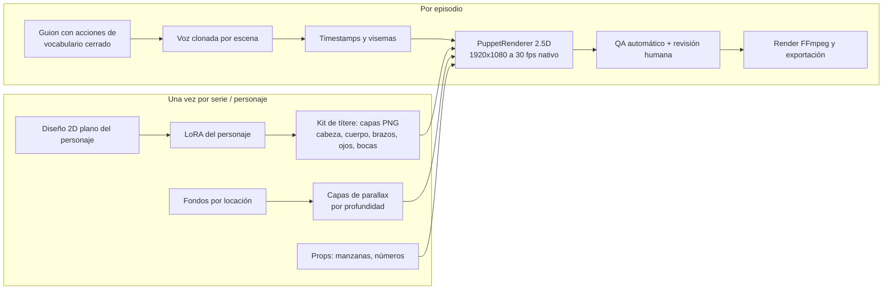
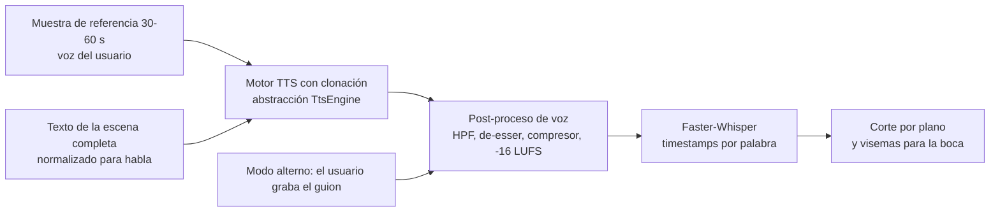

# Plan de Mejora de Calidad — Voz y Animación (Fase 11)

> **Estado:** Propuesto, pendiente de aprobación · **Fecha:** 2026-10-03
> **Episodio de referencia (v1):** "Contando con Tito" — `3d29bcd5-ee1e-4803-bdbb-bf34244a6669`
> **Seguimiento:** [QUALITY_PROGRESS.md](QUALITY_PROGRESS.md)
> **Regla de oro:** no se toca `StoryVideoGenerator/`. Al cerrar cada sub-fase, `git diff --stat -- StoryVideoGenerator` debe salir vacío.

---

## 1. Resumen

El pipeline v1 funciona de punta a punta, pero el resultado no es publicable:

1. **Narración robótica.** Usa Kokoro-82M con la voz `ef_dora`, ralentizada un 12% y sintetizada frase por frase.
2. **Animación tétrica y deforme.** LTX-Video genera el movimiento del personaje sobre un diseño de "pelaje realista con manos humanas", con parámetros incorrectos para el modelo *distilled*. El resultado son manos derretidas, extremidades embarradas y un personaje que cambia entre planos.
3. **El QA no detectó nada.** La métrica CLIP compara la imagen completa, y si falla devuelve 0.85, que es mayor que el umbral de 0.80. Todo pasa.

**Dirección acordada con el usuario:**

| Tema | Decisión del usuario | Traducción técnica |
|---|---|---|
| Estilo visual | "Lo que sea más estable en local y se genere bien" | **2D plano preescolar** (contornos gruesos, colores planos, formas simples) con **animación de recortes / títere 2.5D determinista**. La IA generativa se usa para crear los *assets* una sola vez, no para inventar el movimiento de cada plano. |
| Voz | "Puede ser mi voz u otra, pero natural" | **Clonación de voz zero-shot** a partir de una muestra de referencia (la voz del usuario, con su consentimiento), más un modo alterno de **voz grabada** donde el usuario lee el guion y el sistema alinea. |

---

## 2. Diagnóstico detallado (evidencia)

### 2.1 Animación / imagen

| # | Hallazgo | Evidencia | Impacto |
|---|---|---|---|
| V1 | **Deformación anatómica en el movimiento.** Manos con dedos mal formados, boca "derretida", brazo embarrado en el movimiento. | Fotogramas `docs/frame_scene3.png` (00:20) y `docs/frame_scene6.png` (00:40). | **Crítico.** Es lo que se percibe como tétrico. |
| V2 | **Los 16 clips son de LTX-Video, no de Ken Burns.** | Log de ComfyUI: 37 *prompts* ejecutados, "Model LTXV prepared…" en cada clip (9–13 s c/u). | Confirma que la deformación viene del modelo generativo. |
| V3 | **Parámetros incorrectos para LTX *distilled*.** `steps: 20`, `cfg: 3.0`, `scheduler: normal`. El modelo destilado está pensado para pocos pasos (~8) y CFG ≈ 1 con su propio *scheduler*. | `ai-gateway/workflows/i2v_ltx.json` (nodo `KSAMPLER`). | Alto: genera artefactos y sobre-saturación del movimiento. |
| V4 | **Número de frames probablemente inválido.** 3000 ms × 16 fps = 48 frames; LTX trabaja con longitudes 8n+1 (49, 57, 65…). | `comfy_client.py` L278 (`num_frames = round(dur*fps)`). | Medio: ComfyUI ajusta o recorta sin avisar (está por verificar en Q1). |
| V5 | **Resolución y aspecto incorrectos.** Los clips se generan a 768×512 (3:2) y se escalan a 1920×1080. Resultado: barras negras laterales (*pillarbox*) y una imagen blanda (escalado ×2.1). | Fotogramas con bandas negras; `i2v_ltx.json` y `generate_ken_burns_clip` usan 768×512. | Medio: se ve amateur. |
| V6 | **Conversión de 16 fps a 30 fps** por duplicación de frames, lo que produce tirones (*judder*). | `OUTPUT_VIDEO.frame_rate=16`; render final a 30 fps. | Medio. |
| V7 | **Diseño de personaje poco apto para IA.** Pelaje hiperdetallado, manos humanas con guantes, ropa variable (en un plano trae pantalón y en otro no). | Comparación de los fotogramas 00:20 y 00:40. | **Crítico:** las manos de 5 dedos y el pelaje fino son justo lo que los modelos de video deforman. |
| V8 | **Keyframes con SDXL Turbo a 8 pasos + IP-Adapter a 0.85 en todo el rango** (`start_at 0`, `end_at 1`). Turbo sacrifica detalle y coherencia; con IP-Adapter tan fuerte en todo el rango tiende a copiar pose y fondo de la referencia. | `keyframe_ipadapter.json`. | Alto. |
| V9 | **Prompt negativo pobre.** No incluye manos deformes, dedos extra, extremidades fusionadas, etc. | `keyframe_ipadapter.json` nodo 7, `i2v_ltx.json` nodo 5. | Medio. |
| V10 | **Prompt de movimiento.** El workflow trae por defecto "gentle motion" genérico. Falta verificar si el orquestador envía la acción concreta de cada plano. | `comfy_client.py` L309. | Por verificar en Q1. |

### 2.2 Control de calidad

| # | Hallazgo | Evidencia | Impacto |
|---|---|---|---|
| Q1 | **CLIP ViT-B/32 sobre la imagen completa** no distingue "Tito correcto" de "zorro caricaturesco cualquiera". Por eso todo dio más de 97%. | `clip_similarity.py` (`openai/clip-vit-base-patch32`). | **Crítico:** métrica sin poder discriminante. |
| Q2 | **Si CLIP falla, el servicio devuelve `0.85`**, por encima del umbral de 0.80. Un error se convierte en aprobado. | `clip_similarity.py` L70–73. | **Crítico:** falso positivo silencioso. |
| Q3 | **No hay QA de video.** Nadie revisa los clips animados antes del render. | `AnimationStageService` no invoca QA. | Alto. |
| Q4 | **No hay compuerta de revisión humana** antes del render final. | Flujo `ANIMATION → RENDERING` automático. | Medio. |

### 2.3 Narración

| # | Hallazgo | Evidencia | Impacto |
|---|---|---|---|
| A1 | **Kokoro en español es limitado.** Tiene pocas voces y menos datos de entrenamiento que en inglés; la prosodia sale plana. | `ef_dora` en `config.py`. | **Crítico:** es la causa principal del tono robótico. |
| A2 | **Velocidad -12%** (`speed=0.88`). Ralentizar un TTS alarga las vocales de forma artificial. | `kokoro_tts.py` `_parse_speed`; `Character.ttsRate = "-12%"`. | Alto. |
| A3 | **Síntesis plano por plano.** Cada frase de 4–14 palabras se genera aislada, así que la entonación "reinicia" en cada corte y no hay continuidad narrativa. | `NarrationStageService` (un TTS por `Shot`). | Alto. |
| A4 | **Texto no escrito para ser hablado.** Faltan pausas dramáticas, preguntas al niño ("¿me ayudas a contar?") e interjecciones. Los números conviene escribirlos en palabras. | Guion generado por Ollama. | Medio. |
| A5 | **Sin tratamiento de la voz** antes de la mezcla (EQ, de-esser, compresión). Solo hay `loudnorm` global. | `FFmpegCommandBuilder`. | Medio. |

### 2.4 Bugs colaterales

| # | Hallazgo | Evidencia | Impacto |
|---|---|---|---|
| B1 | **4 planos sin efectos de sonido.** El LLM escribió `"pauseAfterMs: 2500"` dentro del arreglo `sfx`, `resolveSfxPath` intenta abrir `pauseafterms: 2500.mp3` y falla por el carácter `:`. | Log del orquestador: `Error al deserializar sfxJson: Illegal char <:>` ×4. `sanitizeScript` no valida SFX contra el catálogo. | Medio. |
| B2 | **`time.sleep(1.5)` dentro de una función `async`.** Bloquea el *event loop* del AI Gateway durante el *polling* a ComfyUI. | `comfy_client.py` L346. | Bajo-medio: el health y otras peticiones se congelan. |
| B3 | **El manual DOCX tiene contenido no verificado.** La "captura" del dashboard es una maqueta dibujada, las descripciones de escenas no salen del guion real y el "98.2% CLIP" es engañoso (ver Q1). | `scripts/create_dashboard_mockup.py`, `generate_manual_docx.py`. | Medio: hay que corregirlo. |

---

## 3. Arquitectura objetivo

### 3.1 Principio: la IA crea *assets*, el motor anima

En v1 la IA generativa decide el movimiento de cada plano, y ahí nacen las deformaciones. En v2:

**Por qué es lo más estable en local:**
- El personaje **nunca se re-genera por plano**: siempre son las mismas capas aprobadas, así que no puede deformarse ni cambiar de ropa.
- El movimiento (respirar, parpadear, saludar, saltar, señalar, contar) es **matemático** (transformaciones afines con curvas de suavizado). Es 100% reproducible.
- Los props pedagógicos (manzanas) aparecen **exactamente en la palabra correcta** ("¡tres!"), cosa que un modelo de video no garantiza.
- El render es CPU/GPU ligero: segundos por plano, no 11 s de GPU.
- Es el mismo enfoque de producción de muchas series preescolares 2D (animación de recortes / *cut-out*).

**La IA generativa de video queda opcional:** solo para planos de ambiente sin personaje (hojas moviéndose, agua), con Wan 2.2 o LTX bien configurados y siempre detrás de QA.

### 3.2 Voz

---

## 4. Plan de acción por sub-fases

Cada sub-fase tiene **criterios de aceptación medibles**. No se avanza a la siguiente sin cumplirlos.

### Q0 — Banco de pruebas de calidad (base de comparación) · ~2 h
Objetivo: medir antes/después de forma objetiva y no "a ojo".

- **Q0.1** Conjunto dorado: 5 frases fijas de narración (saludo, pregunta al niño, conteo "uno, dos, tres", celebración, despedida) y 4 planos fijos (primer plano, plano medio con acción, plano con props, plano de locación).
- **Q0.2** Script `scripts/quality_bench.py` que genere:
  - una hoja de contacto (*contact sheet*) PNG con 4 frames por plano (inicio, 1/3, 2/3, final) para detectar deformación de un vistazo;
  - una página HTML local de comparación A/B de audio a ciegas, con calificación 1–5 por frase (MOS del usuario).
- **Q0.3** Guardar la línea base v1 en `docs/quality/baseline_v1/`.

**Aceptación:** la línea base v1 queda generada y calificada por el usuario.

### Q1 — Correcciones rápidas del pipeline actual · ~3–4 h
Sirven aunque luego cambie el motor de animación: corrigen bugs reales y mejoran los planos de ambiente.

- **Q1.1 (B1)** Validar `sfx` contra `AudioCatalogService` en `sanitizeScript` y descartar nombres desconocidos o con caracteres inválidos. `resolveSfxCues` debe ignorar el elemento malo, no todo el plano. Agregar tests.
- **Q1.2 (Q2)** Quitar el `return 0.85` de `clip_similarity.py`: un error debe devolver *error* y forzar reintento o revisión.
- **Q1.3 (V3, V4)** LTX *distilled*: pasos, CFG y *scheduler* según la ficha del modelo (verificar en la *model card* de la versión 0.9.8 instalada); longitud 8n+1.
- **Q1.4 (V5, V6)** Generar en 16:9 nativo (p. ej. 1024×576 o 1280×720) y a 24 o 30 fps. Eliminar el *pillarbox*. Interpolación de frames solo si hace falta.
- **Q1.5 (V9, V10)** Prompt negativo ampliado (manos deformes, dedos extra, extremidades fusionadas, cara derretida, terror). Verificar y garantizar que cada plano envíe su acción concreta, en lenguaje de "movimiento sutil".
- **Q1.6 (B2)** Reemplazar `time.sleep` por `await asyncio.sleep`.
- **Q1.7 (A2)** Quitar el -12% de velocidad por defecto (`speed=1.0`) y usar pausas entre frases.

**Aceptación:** tests verdes en Java y Python; 0 warnings de `sfxJson` en un re-render; contact sheet del conjunto dorado sin barras negras y a fps nativo.

### Q2 — Voz natural con clonación · ~1 día
- **Q2.1 Benchmark de motores TTS en español con clonación** (local, 12 GB VRAM). Candidatos a evaluar:

  | Candidato | Por qué | Riesgo a validar |
  |---|---|---|
  | **Chatterbox Multilingual** (Resemble AI) | Clonación zero-shot, soporta español, control de expresividad. | Calidad real en es-MX; verificar licencia vigente (reportada como MIT). |
  | **F5-TTS** con *finetune* en español | Prosodia muy natural. | Los pesos preentrenados oficiales se publicaron con licencia **no comercial**: revisar antes de monetizar. |
  | **XTTS-v2** (Coqui) | Maduro, español nativo. | Licencia CPML **no comercial**: solo como referencia de calidad. |
  | **Kokoro + conversión de voz (RVC)** | Mantiene el TTS rápido y aplica el timbre del usuario. | Doble etapa; artefactos metálicos posibles. |
  | **Kokoro actual** | Línea base. | — |

  > La versión y licencia de cada modelo se verifica al momento de instalarlo y se registra en `docs/LICENSES_MODELS.md`. **Solo pasan a producción los modelos con licencia que permita uso comercial** (YouTube con monetización).

- **Q2.2 Muestra de referencia (tarea del usuario):** ver la sección 6.
- **Q2.3 Abstracción `TtsEngine`** en el AI Gateway (`kokoro | <motor elegido> | recorded`), configurable por personaje (`voiceEngine`, `voiceReferencePath`, `expressiveness`) con migración Flyway `V5__character_voice_engine.sql`.
- **Q2.4 Síntesis por escena, no por plano:** se sintetiza el texto completo de la escena y se corta con los timestamps de Faster-Whisper. La entonación queda continua.
- **Q2.5 Texto para el oído:** normalizar números a palabras, signos de exclamación e interrogación, pausas explícitas. Ajustar el prompt del LLM para frases conversacionales con preguntas al niño y pausa de respuesta.
- **Q2.6 Cadena de post-proceso de voz** (FFmpeg): paso-altos 80 Hz, de-esser, compresión suave, normalización de la pista de voz a -16 LUFS antes de la mezcla (la mezcla final mantiene -14 LUFS).
- **Q2.7 Modo "voz grabada":** exportar el guion como texto de lectura (PDF/TXT con pausas marcadas), endpoint `POST /api/v1/episodes/{id}/narration/upload` para subir el WAV, y alineación y corte automáticos con Whisper.

**Aceptación:** MOS del usuario ≥ 4/5 en naturalidad sobre las 5 frases doradas; WER de Whisper ≤ 5% sobre la voz generada; sin *clipping*; licencia comercial verificada.

### Q3 — Estilo 2D estable y kit de personaje · ~1–1.5 días
- **Q3.1 Benchmark de generadores de imagen** para estilo 2D plano (mismos prompts, mismo seed):
  - SDXL base o un *checkpoint* de caricatura plana a 25–30 pasos (no Turbo);
  - FLUX.1-schnell cuantizado (GGUF) si cabe en 12 GB con tiempos aceptables. Licencia reportada Apache-2.0, a verificar.
- **Q3.2 Nuevo `StyleProfile` "2D Preescolar Plano"** con migración Flyway: contornos gruesos, paleta limitada, sombreado plano, fondos simples. Prompts y negativos dedicados.
- **Q3.3 Rediseño de Tito** apto para animación: formas geométricas simples, **patitas sin dedos** (manopla), ojos grandes de dos estados, vestimenta fija (p. ej. solo bufanda amarilla). Hoja de modelo con vista frontal, 3/4 y perfil.
- **Q3.4 LoRA del personaje:** se curan 20–30 imágenes aprobadas y se entrena una LoRA SDXL en la RTX 5070 (kohya_ss u ostris/ai-toolkit con optimizaciones para 12 GB). Sustituye a IP-Adapter como fuente de identidad.
- **Q3.5 Kit de títere (*rig*):** capas PNG con transparencia (segmentación con BiRefNet o rembg, licencias a verificar):
  - cabeza, cuerpo, brazo izq./der. en 3–4 poses, cola;
  - ojos: abiertos, cerrados, felices;
  - **6–9 formas de boca (visemas)** para *lip-sync*;
  - puntos de pivote definidos en `rig.json`.
- **Q3.6 Biblioteca de locaciones:** 1 fondo por locación (las 3 del seed), separado en 3 capas de profundidad (Depth Anything V2 Small o recorte manual) para el parallax.
- **Q3.7 Props pedagógicos:** sprites de manzana, números 1–10 y estrellas, en el mismo estilo.

**Aceptación:** el usuario aprueba el diseño de Tito v2 y el estilo; el kit pasa un test de ensamblado (todas las capas alinean en sus pivotes).

### Q4 — Motor de animación 2.5D "PuppetRenderer" · ~2 días
- **Q4.1 Vocabulario cerrado de acciones:** `idle`, `talk`, `wave`, `jump`, `point_left/right`, `count` (levanta prop), `clap`, `celebrate`, `walk_in/out`. El LLM solo puede elegir de esta lista (validado en `sanitizeScript`), así que deja de haber movimientos inventados.
- **Q4.2 Modelo de timeline por plano:** acción del personaje, posición, expresión, movimiento de cámara (paneo, zoom suave), aparición de props sincronizada a palabras (`appearAtWord`, ya existente para overlays).
- **Q4.3 Animación procedimental:** respiración (escala sinusoidal), parpadeo aleatorio cada 2–5 s, rebote con *easing*, inclinación de cabeza al hablar.
- **Q4.4 Lip-sync:** visemas derivados del audio con **Rhubarb Lip Sync** (MIT, reconocedor fonético independiente del idioma) o, como alternativa, mapeo fonema→visema desde la transcripción de Whisper.
- **Q4.5 Parallax de fondo** con las 3 capas y movimientos de cámara suaves.
- **Q4.6 Render nativo 1920×1080 a 30 fps** (Pillow/NumPy + PyAV, o Skia si hace falta rendimiento) y entrega del MP4 por plano al pipeline existente (Fase D sin cambios).
- **Q4.7 Integración:** nuevo `animationMode` por serie (`PUPPET_2D | GENERATIVE_I2V | KEN_BURNS`), con `PUPPET_2D` por defecto. I2V queda solo para planos marcados como `AMBIENT`.

**Aceptación:** 0 deformaciones en el conjunto dorado (por construcción); *lip-sync* visualmente correcto en primeros planos; render ≤ 3 s por segundo de video; identidad del personaje idéntica en todos los planos.

### Q5 — QA real y revisión humana · ~4–6 h
- **Q5.1** Reemplazar CLIP de imagen completa por **similitud DINOv2 sobre el recorte del personaje**, con umbral calibrado con ejemplos buenos y malos del conjunto dorado. Aplica a assets generados (kit, fondos) y a planos I2V de ambiente.
- **Q5.2 Juez visual local:** un VLM (p. ej. Qwen2.5-VL 7B vía Ollama) con un checklist fijo: "¿manos o extremidades deformes?", "¿cara distorsionada?", "¿contenido que asuste a un niño?", "¿texto basura?". Si falla, se regenera o se pasa a revisión.
- **Q5.3 QA temporal de clips I2V:** similitud entre frames consecutivos y entre el primer y el último frame. Un salto brusco indica *morphing*.
- **Q5.4 Compuerta humana en el Dashboard:** estado `REVIEW` antes de `RENDERING`, con la galería de planos (contact sheets) y botones aprobar / regenerar plano.

**Aceptación:** el QA rechaza al menos el 90% de un set de planos malos sembrados (incluyendo los fotogramas v1) y no rechaza más del 10% de los buenos.

### Q6 — Episodio v2, comparación y documentación · ~4 h
- **Q6.1** Re-producir "Contando con Tito" con el pipeline v2.
- **Q6.2** Comparación lado a lado v1 vs v2 (contact sheets y MOS de voz) en `docs/quality/v1_vs_v2.md`.
- **Q6.3** Corregir el manual DOCX: **capturas reales** del Dashboard (instalar Playwright en el venv, porque Chrome/Edge headless no generaron la imagen), descripciones de escenas tomadas del guion real y métricas de QA reales.
- **Q6.4** Actualizar `MANUAL_DE_OPERACION.md`, `LICENSES_MODELS.md`, `PROGRESS.md`.

**Aceptación:** el usuario aprueba el episodio v2 como publicable.

---

## 5. Cronograma estimado

| Sub-fase | Duración | Depende de | Bloqueo del usuario |
|---|---|---|---|
| Q0 Banco de pruebas | ~2 h | — | Calificar la línea base |
| Q1 Correcciones rápidas | ~3–4 h | Q0 | — |
| Q2 Voz | ~1 día | Q0 | **Muestra de voz** (sección 6) |
| Q3 Estilo y kit | ~1–1.5 días | Q0 | **Aprobar diseño de Tito v2** |
| Q4 PuppetRenderer | ~2 días | Q3 | — |
| Q5 QA | ~4–6 h | Q3 (en paralelo con Q4) | — |
| Q6 Episodio v2 y docs | ~4 h | Q2, Q4, Q5 | Aprobación final |

Q2 y Q3 pueden avanzar en paralelo. Total estimado: **5–7 días de trabajo efectivo.**

---

## 6. Qué se necesita del usuario

### 6.1 Muestra de voz (para clonación)
- **Duración:** 30–60 segundos de habla continua (mínimo 15 s).
- **Contenido:** leer un cuento corto con **el tono que quieres en el canal** (alegre, cálido, pausado). El modelo copia también la actitud, no solo el timbre.
- **Grabación:** cuarto silencioso sin eco (un clóset con ropa funciona muy bien), celular o micrófono a 15–20 cm, sin música de fondo.
- **Formato:** WAV o FLAC, 24 kHz o más, mono. M4A del celular también sirve; se convierte.
- **Consentimiento:** si es la voz de otra persona, se requiere su autorización por escrito. El canal ya marca `containsSyntheticMedia: true` para YouTube.
- **Ubicación:** `KidsAnimationStudio/assets/voices/<nombre>/reference.wav` (la carpeta queda fuera de git).

### 6.2 Aprobaciones de diseño
- Elegir entre 3–4 propuestas de Tito v2 en estilo 2D plano (Q3.3).
- Calificar las muestras de voz en la página A/B (Q0, Q2).

---

## 7. Riesgos y mitigaciones

| Riesgo | Mitigación |
|---|---|
| Ningún TTS local con licencia comercial alcanza MOS ≥ 4 en español | Modo "voz grabada" (Q2.7): la voz real del usuario es la opción más natural posible. |
| La animación de títere se percibe "rígida" | Animación secundaria (respiración, parpadeo, rebote con *overshoot*), más poses por acción y transiciones con *easing*; es el estándar de series 2D *cut-out*. |
| El entrenamiento de LoRA no cabe en 12 GB | Configuración de bajo consumo (gradient checkpointing, batch 1, fp8/bf16); como alternativa, IP-Adapter con el estilo plano (que deforma menos). |
| Rhubarb da visemas imprecisos en español | Alternativa: mapeo fonema→visema a partir del texto y los timestamps de Whisper; en preescolar basta con 6 bocas. |
| Más tiempo de preparación por serie | Se hace una sola vez por personaje; después cada episodio es más rápido que en v1 (sin 11 s de GPU por plano). |

---

## 8. Métricas de éxito globales (v2 vs v1)

| Métrica | v1 | Objetivo v2 |
|---|---|---|
| Planos con deformación visible (revisión humana) | Varios de 16 (sin cuantificar todavía; se mide en Q0) | **0** |
| Consistencia de vestuario e identidad entre planos | Falla (ropa variable) | 100% (mismo kit) |
| Aspecto del video | 3:2 con barras negras | 16:9 nativo |
| fps de origen | 16 duplicado a 30 | 30 nativo |
| MOS de naturalidad de voz (usuario) | Por medir en Q0 | ≥ 4/5 |
| Planos sin SFX por error | 4 | 0 |
| QA que aprueba en caso de error | Sí (0.85) | No |
