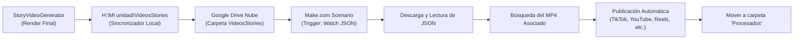

# 🚀 Guía de Integración y Configuración en Make.com
## Lectura y Emparejamiento Automático de Video (`.mp4`) + Metadatos (`.json`) desde Google Drive

---

## 1. Visión General del Flujo

El sistema **StoryVideoGenerator** genera y sincroniza automáticamente dos archivos complementarios en la carpeta de Google Drive (**`H:\Mi unidad\VideosStories\`**):

1. **`[Titulo_de_la_Historia].mp4`**: El video final vertical (1080×1920) con imágenes generadas por IA, música ambiental, narración realista y subtítulos automáticos.
2. **`[Titulo_de_la_Historia]_metadata.json`**: El archivo con los datos del video (título, sinopsis, lista de hashtags virales, duración, género y el nombre exacto del archivo de video en la propiedad `video_file`).



---

## 2. Estrategia de Emparejamiento Seguro (Evitar Fallos de Sincronización)

> [!IMPORTANT]
> **¿Por qué disparar el escenario con el archivo `.json` y no con el `.mp4`?**
> - El archivo `.mp4` pesa entre **25 MB y 80 MB**, por lo que tarda unos segundos en subirse a Google Drive.
> - El archivo `_metadata.json` pesa **menos de 2 KB** y se sube casi instantáneamente.
> - Además, dentro del archivo JSON existe la propiedad **`video_file`** que indica explícitamente el nombre del video que le corresponde (ej. `"El Parpadeo Silencioso.mp4"`).
> 
> **Resultado:** Al configurar el disparador en el archivo `_metadata.json`, Make lee los textos primero, busca el `.mp4` correspondiente por nombre exacto en Drive, y obtiene **ambos archivos sincronizados en la misma ejecución sin condiciones de carrera ni duplicaciones**.

---

## 3. Preparación Previa en Google Drive

1. Entra a tu [Google Drive](https://drive.google.com).
2. Asegúrate de tener la carpeta:
   ```
   Mi unidad / VideosStories /
   ```
3. Crea dentro de ella una subcarpeta llamada:
   ```
   Mi unidad / VideosStories / Procesados /
   ```
   *(Esta carpeta servirá para archivar los videos ya leídos/publicados y evitar que Make los procese dos veces).*

---

## 4. Configuración Paso a Paso en Make.com

Crea un nuevo **Scenario** en Make.com y añade los siguientes módulos en orden:

```
[1. Google Drive] -> [2. Google Drive] -> [3. JSON] -> [4. Google Drive] -> [5. Google Drive] -> [6. Red Social / Notif] -> [7. Google Drive]
 Watch Files         Download JSON        Parse JSON   Search MP4            Download MP4         Publish Video             Move to Procesados
```

---

### Módulo 1: `Google Drive` — **Watch Files in a Folder** (Disparador)

Este módulo detectará cada vez que llegue un nuevo archivo a la carpeta.

- **Connection**: Tu cuenta de Google vinculada.
- **Choose a Folder**: `Select from the list` (o ingresa la ruta `VideosStories`).
- **Folder**: Selecciona tu carpeta `VideosStories`.
- **What to watch**: `Only new files`
- **Limit**: `2` (o `5` si sueles exportar en lotes).

#### Filtro entre Módulo 1 y Módulo 2:
Haz clic en la línea que conecta el Módulo 1 y el Módulo 2 para agregar un **Filtro**:
- **Label**: `Solo Archivos Metadata JSON`
- **Condition**: 
  - `{{1.name}}` **Ends with** (termina en) `_metadata.json`

---

### Módulo 2: `Google Drive` — **Download a File** (Descargar el JSON)

Descarga el contenido del archivo de metadatos recién detectado.

- **Connection**: Misma cuenta de Google.
- **Select**: `Enter manually`
- **File ID**: `{{1.fileId}}` (mapeado desde el Módulo 1).

---

### Módulo 3: `JSON` — **Parse JSON** (Interpretar los Datos)

Convierte el texto plano del archivo descargado en variables utilizables (título, hashtags, video asociado).

- **JSON String**: `{{toString(2.data)}}`

> [!TIP]
> Al ejecutar este módulo por primera vez, Make reconocerá automáticamente los siguientes campos estructurados:
> - `{{3.title}}` (Título de la historia)
> - `{{3.description}}` (Sinopsis completa / Guion)
> - `{{3.hashtags}}` (Arreglo con los hashtags optimizados)
> - `{{3.video_file}}` (Nombre del archivo de video, ej: `El Parpadeo Silencioso.mp4`)
> - `{{3.duration_seconds}}` (Duración en segundos)
> - `{{3.genre}}` (Género de la historia, ej: `HORROR`)

---

### Módulo 4: `Google Drive` — **Search for Files/Folders** (Localizar el MP4)

Busca en la misma carpeta el archivo de video cuyo nombre coincide con `video_file`.

- **Search in**: `Specific folder`
- **Folder ID**: Selecciona la carpeta `VideosStories`.
- **Query**: 
  ```text
  name = '{{3.video_file}}' and trashed = false
  ```
- **Limit**: `1`

---

### Módulo 5: `Google Drive` — **Download a File** (Descargar el Video MP4)

Descarga el archivo físico del video para pasarlo a la red social o webhook.

- **Select**: `Enter manually`
- **File ID**: `{{4.id}}` (obtenido del Módulo 4 de búsqueda).

---

### Módulo 6: Publicador de Redes Sociales (TikTok / YouTube / Instagram / Webhook)

Aquí conectas la plataforma a donde deseas enviar el video y los textos.

#### Ejemplo A: **YouTube** — *Upload a Video* (YouTube Shorts)
- **Title**: `{{3.title}} #Shorts`
- **Description**: 
  ```text
  {{3.description}}

  {{join(3.hashtags; " ")}}
  ```
- **Video File**: `{{5.data}}`
- **Category ID**: `Entertainment` (o `Film & Animation`)
- **Privacy Status**: `Public` (o `Private` si deseas revisarlo antes de que salga al aire).

#### Ejemplo B: **TikTok for Business** / **Instagram for Business** / **Facebook Pages**
- **Caption / Texto**:
  ```text
  {{3.title}}

  {{3.description}}

  {{join(3.hashtags; " ")}}
  ```
- **Video File**: `{{5.data}}`

---

### Módulo 7: `Google Drive` — **Move a File** (Organización y Limpieza)

Mueve los dos archivos procesados a la subcarpeta `Procesados` para que la carpeta raíz quede limpia y nunca se procese dos veces un mismo video.

1. **Mover el archivo JSON**:
   - **File ID**: `{{1.fileId}}`
   - **New Folder ID**: Selecciona `VideosStories / Procesados`

2. **Mover el archivo MP4**:
   - Puedes clonar este módulo inmediatamente después:
   - **File ID**: `{{4.id}}`
   - **New Folder ID**: Selecciona `VideosStories / Procesados`

---

## 5. Fórmulas Útiles en Make.com

| Caso de Uso | Fórmula en Make | Resultado Ejemplo |
| :--- | :--- | :--- |
| **Convertir lista de hashtags en un solo texto** | `{{join(3.hashtags; " ")}}` | `#horror #terror #creepy #miedo #viral` |
| **Cortar descripción a 150 caracteres** | `{{substring(3.description; 0; 150)}}...` | `Mateo, un hombre escéptico, toma el trabajo...` |
| **Generar título dinámico con género** | `[{{3.genre}}] {{3.title}}` | `[HORROR] El Parpadeo Silencioso` |
| **Tags como lista separada por comas** | `{{join(3.hashtags; ", ")}}` | `#horror, #terror, #creepy` |

---

## 6. Blueprint de Make.com Listo para Importar

Puedes importar este escenario en Make.com en 3 clics:
1. Copia el siguiente código JSON.
2. En Make.com, crea un escenario en blanco, haz clic derecho sobre el lienzo y selecciona **"Import Blueprint"**.
3. Pega el código y vincula tu cuenta de Google Drive.

<details>
<summary>📋 <b>Haz clic aquí para ver / copiar el Blueprint JSON</b></summary>

```json
{
  "name": "StoryVideo - Lector y Emparejador Google Drive",
  "flow": [
    {
      "id": 1,
      "module": "google-drive:watchFiles",
      "version": 1,
      "parameters": {
        "watchType": "new",
        "limit": 2
      },
      "filter": {
        "name": "Es archivo de metadatos JSON",
        "conditions": [
          [
            {
              "a": "{{1.name}}",
              "o": "text:endswith",
              "b": "_metadata.json"
            }
          ]
        ]
      }
    },
    {
      "id": 2,
      "module": "google-drive:downloadFile",
      "version": 1,
      "parameters": {
        "fileId": "{{1.fileId}}"
      }
    },
    {
      "id": 3,
      "module": "json:ParseJSON",
      "version": 1,
      "parameters": {
        "json": "{{toString(2.data)}}"
      }
    },
    {
      "id": 4,
      "module": "google-drive:searchFiles",
      "version": 1,
      "parameters": {
        "query": "name = '{{3.video_file}}' and trashed = false",
        "limit": 1
      }
    },
    {
      "id": 5,
      "module": "google-drive:downloadFile",
      "version": 1,
      "parameters": {
        "fileId": "{{4.id}}"
      }
    },
    {
      "id": 6,
      "module": "google-drive:moveFile",
      "version": 1,
      "parameters": {
        "fileId": "{{1.fileId}}"
      }
    },
    {
      "id": 7,
      "module": "google-drive:moveFile",
      "version": 1,
      "parameters": {
        "fileId": "{{4.id}}"
      }
    }
  ]
}
```

</details>

---

## 7. Preguntas Frecuentes y Buenas Prácticas

### ¿Con qué frecuencia programar el escenario en Make?
- **Recomendado:** `At regular intervals` cada **15 a 30 minutos**.
- Esto ahorra operaciones mensuales en tu plan de Make.com y le da tiempo a Google Drive Desktop de subir el archivo `.mp4` completamente antes de que el escenario lo consulte.

### ¿Qué pasa si el video es muy pesado y el JSON se sube primero?
Si tu conexión de subida es lenta y Make procesa el JSON antes de que termine de subir el MP4, puedes añadir entre el Módulo 3 y el Módulo 4 un módulo **Tools → Sleep** configurado en **10 a 20 segundos** para garantizar que Google Drive Desktop haya finalizado la carga del video.

### ¿Se conservan los caracteres especiales (tildes, eñes)?
Sí. StoryVideoGenerator codifica la metadata y los subtítulos explícitamente en **UTF-8**, por lo que caracteres como `á, é, í, ó, ú, ñ` y signos de puntuación se transmitirán limpios a Make y a las redes sociales.

### ¿Si Make mueve los archivos a `Procesados`, el script de sincronización los volverá a subir?
**No.** El script de sincronización ([`sync-to-drive.ps1`](file:///c:/Users/villa/GIT%20DESKTOP/AIO/StoryVideoGenerator/sync-to-drive.ps1)) cuenta con **triple protección anti-bucles**:
1. **Detección de la carpeta `Procesados`**: Si el archivo ya existe dentro de `H:\Mi unidad\VideosStories\Procesados\`, el script reconoce que Make ya lo tomó y **no lo vuelve a subir**.
2. **Historial persistente (`.synced_history.txt`)**: Guarda en local una marca de agua con el nombre y la fecha exacta del archivo. Si Make lo mueve o incluso si lo borra, el script sabe que esa versión ya fue entregada exitosamente.
3. **Soporte para re-renders**: Solo se volverá a sincronizar si deliberadamente decides regenerar o reeditar un video en el sistema (lo cual actualiza la fecha de modificación del archivo en `export_videos/`).

