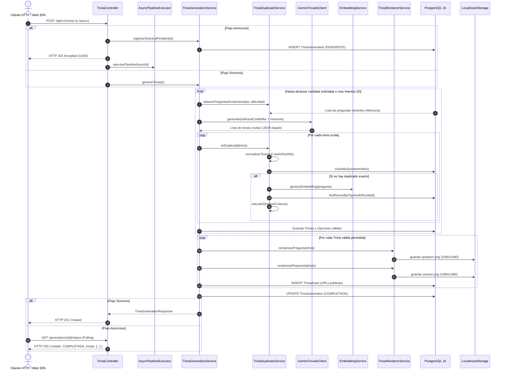
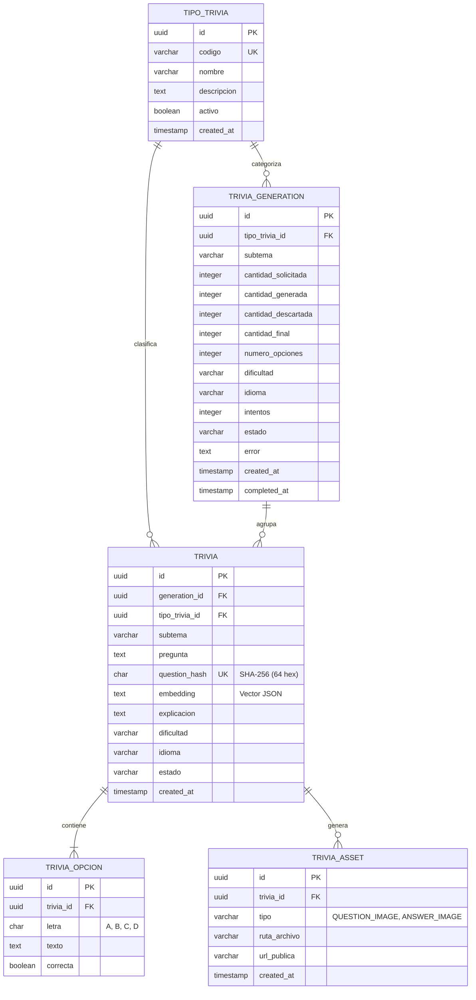

# Documentación Técnica del Código y Arquitectura

Esta documentación detalla la arquitectura, el diseño de componentes, las decisiones técnicas y el funcionamiento interno de cada módulo de la plataforma **TriviaGenerator AI**.

---

## 1. Visión General del Sistema

**TriviaGenerator AI** es un backend modular de alto rendimiento construido sobre **Spring Boot 3.3.0** y **Java 21 LTS**, diseñado para resolver la generación, deduplicación, enriquecimiento visual y consulta de trivias automatizadas mediante Inteligencia Artificial (**Google Gemini 3.5 Flash-Lite**).

### Objetivos Clave de Ingeniería:
1. **Generación Tipada con IA**: Uso de *Structured Outputs* (JSON Schema nativo) para garantizar respuestas estrictamente estructuradas sin fallos de parsing.
2. **Memoria del Sistema**: Inyección de preguntas existentes en el prompt del LLM para evitar repeticiones desde el origen.
3. **Deduplicación Híbrida Multinivel**:
   * *Nivel 1 (Exacto)*: Normalización Unicode NFC, remoción de signos y cálculo de hash SHA-256 (64 hex).
   * *Nivel 2 (Intra-Lote)*: Detección y filtrado de colisiones dentro de la misma respuesta del LLM.
   * *Nivel 3 (Persistente)*: Comprobación contra la base de datos PostgreSQL mediante índices de hash únicos.
   * *Nivel 4 (Semántico)*: Vectorización de preguntas (embeddings) y comparación por similitud coseno con umbral estricto (0.90).
4. **Bucle de Regeneración Automática**: Si un lote contiene trivias duplicadas, el servicio solicita un buffer adicional o reintenta automáticamente hasta satisfacer la cuota solicitada o alcanzar el límite de reintentos (`MAX_GENERATION_ATTEMPTS`).
5. **Renderizado Visual Headless (AWT Graphics2D)**: Generación programática de dos tarjetas gráficas PNG en alta definición (1080x1080) por cada trivia (`question.png` y `answer.png`), sin sobrecosto de navegadores embebidos como Chromium.
6. **Doble Modalidad de Consumo**:
   * Síncrona (`POST /api/v1/trivias` → HTTP 201 Created).
   * Asíncrona (`POST /api/v1/trivias/async` → HTTP 202 Accepted + Polling de estado en vivo).
7. **Interfaz Web Local (SPA)**: Dashboard interactivo para pruebas y modo juego embebido en el propio servidor (`/`).

---

## 2. Arquitectura Global y Flujo de Datos

El sistema sigue una arquitectura en capas basada en los principios de **Clean Architecture** y **Domain-Driven Design (DDD)** simplificado:

```
┌────────────────────────────────────────────────────────────────────────┐
│                        CAPA DE PRESENTACIÓN                            │
│  TriviaController   │   CatalogController   │   HealthController       │
│               Filtros: ApiKeyFilter  &  RateLimitingFilter             │
└───────────────────────────────────┬────────────────────────────────────┘
                                    │
┌───────────────────────────────────▼────────────────────────────────────┐
│                        CAPA DE APLICACIÓN                              │
│  TriviaGenerationService  │  AsyncTriviaPipelineExecutor  │  Query     │
└─────────┬─────────────────────────┬──────────────────────────┬─────────┘
          │                         │                          │
┌─────────▼───────────────┐ ┌───────▼──────────────┐ ┌─────────▼─────────┐
│ DEDUPLICACIÓN & EMBED   │ │   CLIENTE IA GEMINI  │ │  RENDERER GRÁFICO │
│ TriviaDuplicateService  │ │ GeminiTriviaAiClient │ │ TriviaRenderer    │
│ QuestionHashService     │ │ (gemini-3.5-flash)   │ │ (AWT Graphics2D)  │
│ TriviaQuestionNormalizer│ │ EmbeddingServiceImpl │ │ AssetStorage      │
└─────────┬───────────────┘ └───────┬──────────────┘ └─────────┬─────────┘
          │                         │                          │
┌─────────▼─────────────────────────▼──────────────────────────▼─────────┐
│                    CAPA DE PERSISTENCIA Y DOMINIO                      │
│   Entidades JPA: TipoTrivia, TriviaGeneration, Trivia, Opcion, Asset   │
│   Spring Data JPA Repositories  │  PostgreSQL 16  │  Flyway Migration │
└────────────────────────────────────────────────────────────────────────┘
```

### Diagrama de Secuencia del Pipeline de Generación



---

## 3. Estructura de Paquetes y Módulos

El proyecto se organiza bajo el paquete base `com.trivia.api`:

```
src/main/java/com/trivia/api/
├── TriviaApiApplication.java                   # Punto de arranque Spring Boot (@EnableAsync)
│
├── ai/                                         # Integración con LLM y Embeddings
│   ├── TriviaAiClient.java                     # Interfaz agnóstica para clientes de IA
│   ├── GeminiTriviaAiClient.java               # Implementación oficial para Google Gemini
│   ├── EmbeddingService.java                   # Interfaz de vectorización semántica
│   ├── EmbeddingServiceImpl.java               # text-embedding-004 con fallback local L2
│   ├── dto/                                    # DTOs internos de transporte IA
│   └── exception/AiClientException.java        # Excepción unificada para fallos de LLM
│
├── controller/                                 # Controladores REST (Spring MVC)
│   ├── TriviaController.java                   # Endpoints de generación, consulta y stats
│   ├── CatalogController.java                  # Endpoints del catálogo de tipos de trivia
│   └── HealthController.java                   # Verificación de salud y conectividad
│
├── domain/                                     # Entidades del Dominio JPA
│   ├── TipoTrivia.java                         # Categoría (CIENCIA, HISTORIA, etc.)
│   ├── TriviaGeneration.java                   # Registro y auditoría de la solicitud
│   ├── Trivia.java                             # Entidad raíz de la trivia generada
│   ├── TriviaOpcion.java                       # Opciones múltiples (A, B, C, D)
│   ├── TriviaAsset.java                        # Metadatos de imágenes PNG asociadas
│   └── [Enums: Dificultad, EstadoTrivia, EstadoGeneracion, TipoAsset]
│
├── dto/                                        # Data Transfer Objects (Java Records)
│   ├── TriviaGenerationRequest.java            # Request con validaciones Bean Validation
│   ├── TriviaGenerationResponse.java           # Estado y resultados de la generación
│   ├── TriviaResponse.java                     # Detalle de trivia con opciones y assets
│   ├── TriviaOpcionResponse.java               # DTO de opción con flag de respuesta correcta
│   ├── TriviaAssetResponse.java                # DTO con URLs públicas de imágenes
│   └── StatsResponse.java                      # Métricas globales de la plataforma
│
├── exception/                                  # Manejo global de excepciones
│   ├── GlobalExceptionHandler.java             # RFC 7807 ProblemDetails unificado
│   └── InsufficientUniqueTriviasException.java  # Error cuando se agotan los reintentos
│
├── infrastructure/                             # Configuración técnica y adaptadores
│   ├── config/WebMvcConfig.java                # Static mapping (/assets/** y classpath:/static/)
│   ├── config/WebCorsConfig.java               # Reglas CORS globales para clientes web/móvil
│   ├── security/ApiKeyFilter.java              # Filtro de autenticación X-API-KEY
│   ├── security/RateLimitingFilter.java        # Limitador de tasa por IP en memoria
│   └── storage/LocalAssetStorageService.java   # Almacenamiento en sistema de archivos local
│
├── normalizer/                                 # Normalización lingüística
│   └── TriviaQuestionNormalizer.java           # NFC Unicode, signos ortográficos y espacios
│
├── repository/                                 # Repositorios Spring Data JPA
│   ├── TipoTriviaRepository.java
│   ├── TriviaGenerationRepository.java
│   ├── TriviaRepository.java
│   ├── TriviaOpcionRepository.java
│   └── TriviaAssetRepository.java
│
└── service/                                    # Lógica de Negocio y Orquestación
    ├── CatalogService.java                     # Gestión del catálogo con auto-registro dinámico
    ├── CategorySimilarityMatcher.java          # Normalización y fuzzy matching de categorías
    ├── QuestionHashService.java                # Algoritmo de hash criptográfico SHA-256
    ├── TriviaDuplicateService.java             # Motor de deduplicación híbrida
    ├── TriviaValidationService.java            # Reglas de negocio para validar respuestas
    ├── TriviaGenerationService.java            # Orquestador del pipeline de generación
    ├── AsyncTriviaPipelineExecutor.java        # Ejecutor asíncrono desacoplado (@Async)
    ├── TriviaRendererService.java              # Motor de renderizado gráfico AWT (PNG)
    ├── AssetStorageService.java                # Interfaz de persistencia de archivos
    └── TriviaQueryService.java                 # Consultas de lectura optimizadas (@Transactional readOnly)
```

---

## 4. Análisis Detallado de Componentes

### 4.1. Normalización y Hash Criptográfico

El sistema garantiza que preguntas lingüísticamente equivalentes produzcan el mismo hash SHA-256 para permitir búsquedas `O(1)` indexadas en base de datos.

#### [`TriviaQuestionNormalizer.java`](file:///c:/Users/villa/GIT%20DESKTOP/AIO/triviaGenerator/src/main/java/com/trivia/api/normalizer/TriviaQuestionNormalizer.java)
* **Forma Canónica Unicode (NFC)**: Normaliza caracteres combinados (`Normalizer.normalize(s, Normalizer.Form.NFC)`).
* **Preservación de Acentos en Español**: A diferencia de normalizadores en inglés que eliminan diacríticos (`canción` -> `cancion`), el motor en español preserva `á, é, í, ó, ú, ü, ñ`, evitando ambigüedades semánticas.
* **Eliminación de Signos de Apertura y Cierre**: Remueve signos de interrogación y exclamación (`¿`, `?`, `¡`, `!`), comillas, puntos y paréntesis.
* **Colapso de Espacios y Minúsculas**: Convierte a minúsculas usando `Locale.ROOT` y reemplaza secuencias de múltiples espacios por un espacio simple.

#### [`QuestionHashService.java`](file:///c:/Users/villa/GIT%20DESKTOP/AIO/triviaGenerator/src/main/java/com/trivia/api/service/QuestionHashService.java)
* Toma el texto normalizado y aplica `MessageDigest.getInstance("SHA-256")`.
* Produce un string hexadecimal estricto de **64 caracteres**, indexado como clave única (`unique = true`) en la tabla `trivia`.

---

### 4.2. Motor de Deduplicación Híbrida (`TriviaDuplicateService`)

La deduplicación opera en **4 filtros consecutivos**:

1. **Filtro de Memoria de Sesión (Intra-Batch)**:
   * Evita que el LLM repita preguntas dentro del mismo lote devuelto. Se mantiene un `Set<String>` con los hashes de las preguntas aceptadas durante la ejecución actual.
2. **Filtro de Base de Datos Exacto**:
   * Consulta directa al repositorio: `triviaRepository.existsByQuestionHash(hash)`.
3. **Filtro Semántico por Embeddings Vectoriales**:
   * Si la pregunta supera el filtro exacto, se genera su vector numérico (128 dimensiones).
   * Se recuperan los embeddings de trivias recientes del mismo tipo y dificultad.
   * Se calcula la **Similitud Coseno**:
     $$\text{similitud} = \frac{\mathbf{A} \cdot \mathbf{B}}{\|\mathbf{A}\| \|\mathbf{B}\|}$$
   * Si la similitud supera el umbral configurado (`TRIVIA_DUPLICATE_SIMILARITY_THRESHOLD`, por defecto `0.90`), se descarta como duplicado semántico.

---

### 4.3. Cliente de Inteligencia Artificial (`GeminiTriviaAiClient`)

Implementa la interfaz `TriviaAiClient` mediante el cliente HTTP asíncrono nativo de Java 21 (`java.net.http.HttpClient`):

* **Modelo Configurado**: `gemini-3.5-flash-lite`.
* **Structured Outputs Nativos**:
  Se envía el parámetro `generationConfig` con `response_mime_type: application/json` y un esquema `response_schema` que obliga al LLM a devolver un array de objetos con las propiedades:
  * `pregunta`: string
  * `explicacion`: string
  * `opciones`: array de objetos `{ letra, texto, correcta }`
* **Inyección de Memoria del Sistema**:
  El prompt incluye una sección explícita:
  ```
  HISTORIAL DE PREGUNTAS YA EXISTENTES (PROHIBIDO REPETIR O PARAFRASEAR):
  - ¿En qué año llegó el hombre a la Luna?
  - ¿Cuál es el planeta más grande del Sistema Solar?
  ...
  ```
  Esto reduce las colisiones antes de que ocurran.

---

### 4.4. Motor de Renderizado Gráfico (`TriviaRendererService`)

En lugar de utilizar motores basados en Chromium (como Playwright o Puppeteer) que aumentan el peso de las imágenes Docker en más de 200 MB, el renderizado se implementa completamente en **Java AWT / Graphics2D**:

* **Resolución**: 1080 x 1080 píxeles a 72 DPI (formato óptimo para redes sociales y pantallas móviles).
* **Antialiasing y Calidad**:
  ```java
  g2d.setRenderingHint(RenderingHints.KEY_ANTIALIASING, RenderingHints.VALUE_ANTIALIAS_ON);
  g2d.setRenderingHint(RenderingHints.KEY_TEXT_ANTIALIASING, RenderingHints.VALUE_TEXT_ANTIALIAS_ON);
  g2d.setRenderingHint(RenderingHints.KEY_RENDERING, RenderingHints.VALUE_RENDER_QUALITY);
  ```
* **Tipos de Assets Generados**:
  1. `question.png` (`TipoAsset.QUESTION_IMAGE`): Fondo degradado oscuro (azul medianoche/índigo), insignia de categoría, pregunta con ajuste de línea automático (*word wrap*), e insignias de opciones (A, B, C, D).
  2. `answer.png` (`TipoAsset.ANSWER_IMAGE`): Fondo degradado esmeralda oscuro, tarjeta con la opción ganadora resaltada en verde brillante y caja con la explicación pedagógica.
* **Compatibilidad Alpine Linux**: El `Containerfile` instala `fontconfig` y `ttf-dejavu` para asegurar la disponibilidad de fuentes sans-serif de alta calidad en contenedores mínimos.

---

### 4.5. Orquestador y Concurrencia Asíncrona

#### [`TriviaGenerationService.java`](file:///c:/Users/villa/GIT%20DESKTOP/AIO/triviaGenerator/src/main/java/com/trivia/api/service/TriviaGenerationService.java)
Controla el flujo de cálculo del buffer (+50%), el bucle de reintentos (hasta 5 intentos) y la persistencia transaccional.

#### [`AsyncTriviaPipelineExecutor.java`](file:///c:/Users/villa/GIT%20DESKTOP/AIO/triviaGenerator/src/main/java/com/trivia/api/service/AsyncTriviaPipelineExecutor.java)
* **Principio de Diseño Spring AOP**: Para que la anotación `@Async` funcione en Spring Boot, el método debe ser invocado desde un bean externo a través del proxy dinámico. Separar el ejecutor asíncrono en su propia clase evita el clásico error de invocación interna (*self-invocation*).
* Actualiza los estados de la entidad `TriviaGeneration`: `PENDIENTE` → `GENERANDO` → `COMPLETADA` o `ERROR`.

---

### 4.6. Seguridad y Protección de la API

1. **[`ApiKeyFilter.java`](file:///c:/Users/villa/GIT%20DESKTOP/AIO/triviaGenerator/src/main/java/com/trivia/api/infrastructure/security/ApiKeyFilter.java)**:
   * Filtro `OncePerRequestFilter`.
   * Verifica la cabecera `X-API-KEY`.
   * Las operaciones de lectura (`GET`, `OPTIONS`), health checks (`/api/v1/health`), documentación (`/swagger-ui/**`, `/v3/api-docs/**`) y assets (`/assets/**`) son públicas.
   * Si la variable `API_KEY` está vacía en `.env`, el filtro entra en modo permisivo para facilitar el desarrollo local.
2. **[`RateLimitingFilter.java`](file:///c:/Users/villa/GIT%20DESKTOP/AIO/triviaGenerator/src/main/java/com/trivia/api/infrastructure/security/RateLimitingFilter.java)**:
   * Ventana deslizante por minuto basada en la IP del cliente (soporta cabecera `X-Forwarded-For`).
   * Límite configurable (`trivia.security.rate-limit.max-requests: 120` req/min).
   * Responde con `HTTP 429 Too Many Requests` y cabecera `Retry-After: 60`.
3. **[`WebCorsConfig.java`](file:///c:/Users/villa/GIT%20DESKTOP/AIO/triviaGenerator/src/main/java/com/trivia/api/infrastructure/config/WebCorsConfig.java)**:
   * Permite peticiones desde cualquier origen (`*`) con métodos `GET, POST, PUT, DELETE, OPTIONS`.

---

## 5. Modelo de Datos y Esquema Relacional

La persistencia está respaldada por **PostgreSQL 16** con versionamiento mediante migraciones **Flyway** (`V1` a `V6`):



---

## 6. Catálogo de Endpoints REST

| Método | Ruta | Descripción | Auth (`X-API-KEY`) | Respuesta Exitosa |
|---|---|---|:---:|:---:|
| `GET` | `/api/v1/health` | Estado del servidor y tiempo de actividad | No | `200 OK` |
| `GET` | `/api/v1/catalogos/tipos-trivia` | Listado de categorías oficiales activas | No | `200 OK` |
| `POST` | `/api/v1/trivias` | Generación síncrona con IA y renderizado | Sí* | `201 Created` |
| `POST` | `/api/v1/trivias/async` | Generación asíncrona en segundo plano | Sí* | `202 Accepted` |
| `GET` | `/api/v1/trivias/generations/{id}/status` | Sondeo en vivo de generación asíncrona | No | `200 OK` |
| `GET` | `/api/v1/trivias/{id}` | Detalle completo de una trivia por UUID | No | `200 OK` |
| `GET` | `/api/v1/trivias/random` | Obtiene una trivia activa al azar | No | `200 OK` |
| `GET` | `/api/v1/trivias/search?q=...` | Búsqueda por texto paginada | No | `200 OK` |
| `GET` | `/api/v1/trivias` | Listado paginado de todas las trivias | No | `200 OK` |
| `GET` | `/api/v1/trivias/stats` | Estadísticas y métricas del repositorio | No | `200 OK` |
| `GET` | `/assets/**` | Servicio directo de imágenes PNG generadas | No | `200 OK` (image/png) |
| `GET` | `/` o `/index.html` | Interfaz Web SPA interactiva | No | `200 OK` (text/html) |

*\* Requiere `X-API-KEY` únicamente si la variable `API_KEY` está configurada en el entorno.*

---

## 7. Estrategia de Pruebas Automatizadas

La suite cuenta con **89 pruebas automatizadas** organizadas por capas de abstracción:

```
Resultados de la suite:
Tests run: 89, Failures: 0, Errors: 0, Skipped: 0 (100% pasando)
```

### Cobertura por Paquetes de Prueba:
1. **Catálogo y Similitud Difusa** (`CategorySimilarityMatcherTest`, `CatalogServiceTest`):
   * Coincidencias exactas, insensibles a mayúsculas y acentos (`Astronomía` -> `ASTRONOMIA`).
   * Detección de singular/plural y raíces compartidas (`Historias` -> `HISTORIA`, `Animal` -> `ANIMALES`).
   * Prevención de falsos positivos en palabras con raíces diferentes (`GASTRONOMIA` vs `ASTRONOMIA`).
   * Auto-creación dinámica de nuevas categorías en base de datos (`Cine y Series` -> `CINE_Y_SERIES`).
2. **Normalización y Hashes** (`TriviaQuestionNormalizerTest`, `QuestionHashServiceTest`):
   * Preservación de acentos en español (`á, é, í, ó, ú, ñ`).
   * Eliminación de signos de interrogación `¿?`, comillas y puntuación.
   * Colapso de espacios múltiples y estabilidad determinista del SHA-256.
3. **Deduplicación** (`TriviaDuplicateServiceTest`):
   * Detección de duplicados exactos en lote y en base de datos.
   * Detección de duplicados semánticos por similitud coseno.
4. **Cliente de IA** (`GeminiTriviaAiClientTest`):
   * Mocking del `HttpClient` de Java 21 para simular respuestas de Gemini.
   * Manejo de cuotas y errores de API (`HTTP 429 Resource Exhausted`, validación de API Key).
5. **Validación y Pipeline** (`TriviaValidationServiceTest`, `TriviaGenerationServiceTest`):
   * Reglas de validación (opción correcta única, mínimo de opciones, respuestas no vacías).
   * Bucle de reintento automático y lanzamiento de `InsufficientUniqueTriviasException`.
6. **Renderizado de Imágenes** (`TriviaRendererServiceTest`, `LocalAssetStorageServiceTest`):
   * Creación de imágenes AWT sin entorno gráfico (modo headless).
   * Verificación de dimensiones (1080x1080) y encabezado de bytes del formato PNG (`89 50 4E 47`).
7. **Controladores Web** (`CatalogControllerTest`, `HealthControllerTest`, `TriviaControllerTest`):
   * Pruebas con `MockMvc` extendiendo `AbstractControllerTest`.
   * Validación de respuestas en formato RFC 7807 (`ProblemDetail`).
8. **Filtros de Seguridad** (`ApiKeyFilterTest`):
   * Validación de rechazo `HTTP 401 Unauthorized` cuando falta la cabecera `X-API-KEY`.
   * Exención de métodos `GET` y endpoints públicos.

---

## 8. Guía de Mantenimiento y Extensiones Futuras

1. **Agregar Nuevos Proveedores de IA**:
   * Implementar la interfaz [`TriviaAiClient`](file:///c:/Users/villa/GIT%20DESKTOP/AIO/triviaGenerator/src/main/java/com/trivia/api/ai/TriviaAiClient.java) (por ejemplo, `OpenAiTriviaAiClient` o `AnthropicTriviaAiClient`).
   * Configurar el bean activo en el contexto de Spring según la propiedad `trivia.ai.provider`.
2. **Cambiar la Fuente de Almacenamiento**:
   * Implementar la interfaz [`AssetStorageService`](file:///c:/Users/villa/GIT%20DESKTOP/AIO/triviaGenerator/src/main/java/com/trivia/api/service/AssetStorageService.java) para servicios en la nube (AWS S3, Cloudflare R2, Google Cloud Storage).
3. **Personalizar las Plantillas Gráficas**:
   * Modificar [`TriviaRendererService.java`](file:///c:/Users/villa/GIT%20DESKTOP/AIO/triviaGenerator/src/main/java/com/trivia/api/service/TriviaRendererService.java) para agregar logotipos de marca, cambiar paletas de colores por categoría o ajustar tipografías.
